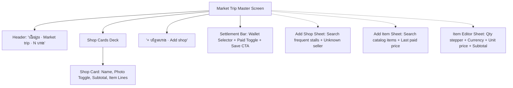

# FRD — Market Trip & Product Purchases (Multi-Shop Batch)
## Document Ref: `BONCHI-FRD-04`

- **System:** Bonchi Restaurant Money App
- **Module:** Multi-Shop Market Trip Purchases & Batch Invoicing
- **Prototype Screen:** Screen 3 — `3 · ទិញទំនិញ Product purchase` (`3_Product_purchase_unbundled.html`)
- **Companion PRD:** [Bonchi_Restaurant_Money_App_PRD.md](file:///d:/Bonchi%20System/Bonchi_Restaurant_Money_App_PRD.md#feature-4-market-trip--multi-shop-batch-invoicing)

---

## 1. Feature Overview & Objectives
Staff regularly embark on morning wet market trips purchasing ingredients across 3 to 10 distinct stalls (meat vendor, rice shop, vegetable seller, spice shop). This module enables entering all items bought during one market trip in a continuous flow, while automatically generating separate, normalized supplier invoices in the database.

---

## 2. UI/UX Wireframe & Sub-Sheets



### 2.1 Sub-Sheet Specifications

#### A. Add Shop Sheet (`ជ្រើសហាង · Choose a shop`)
- Search Input: `placeholder="ស្វែងរកហាង ឬ បង្កើតថ្មី"`.
- Frequent Stalls List (Pre-loaded with purchase frequency hints):
  1. `ហាងសាច់ ផ្សារថ្មី` (Chicken, Pork · 12 purchases)
  2. `ហាងអង្ករ មីងស្រី` (Rice, Oil · 8 purchases)
  3. `ហាងបន្លែ ផ្សារដើមគរ` (Vegetables, Fruit · 6 purchases)
  4. `ហាងគ្រឿងទេស បងណារី` (Fish sauce, Spices · 3 purchases)
- Fallback Stalls Option:
  - `អ្នកលក់មិនស្គាល់ឈ្មោះ` (Unknown seller · Market or street cart).

#### B. Add Item Sheet (`ជ្រើសមុខទំនិញ · Choose Item`)
- Catalog Search Input: `placeholder="ស្វែងរក · sach, chicken..."`.
- Standard Product Catalog List (Shows last paid price hint):
  - `ប្រេងឆា` (Cooking oil) — `ដប` (Bottle) — Last: `$6.00`
  - `បន្លែស្រស់` (Fresh vegetables) — `គីឡូ` (Kg) — Last: `3,000 ៛`
  - `ស៊ុតមាន់` (Chicken eggs) — `គ្រាប់` (Egg) — Last: `500 ៛`
  - `ទឹកត្រី` (Fish sauce) — `ដប` (Bottle) — Last: `$1.25`
  - `សាច់ជ្រូក` (Pork) — `គីឡូ` (Kg) — Last: `$4.75`

#### C. Item Editor Sheet
- Item name & target shop title display.
- **Quantity Steppers:**
  - `−` Decrement button (Min: 1).
  - Center quantity display with unit e.g. `10 គីឡូ`.
  - `+` Increment button.
- **Currency Buttons:**
  - Toggle between `$ ដុល្លារ` and `៛ រៀល`.
- **Unit Price Input:**
  - Masked inputmode: `decimal` for USD, `numeric` for KHR.
  - Automatically sanitizes characters:
    - KHR: `/ [^0-9] /g`
    - USD: `/ [^0-9.] /g`
- **Historical Price Anchor:** Displays last purchase rate: e.g. `ចុងក្រោយពីហាងនេះ៖ $3.50 · 2 តុលា`.
- **Live Line Total:** Dynamically updates $\text{Quantity} \times \text{Unit Price}$.
- **Actions:** Delete button (`លុប`) and Confirm button (`រួចរាល់`).

---

## 3. Batch Saving & Settlement Engine

1. **Receipt Photo Attachment:** Each shop card features an interactive camera icon button. Tapping toggles photo state (`photo: true/false`).
2. **Payment Settlement:**
   - Source wallet selector: Defaults to Petty Cash (`បង់ពី លុយចាយ`).
   - Payment status toggle: `paid` (On the spot) vs `unpaid` (Supplier credit).
3. **Save Action:**
   - Button text: `រក្សាទុក {invoiceCount} វិក្កយបត្រ` (e.g. Save 2 invoices).
   - If no shops have valid items, button is disabled (`p-btn-off`).

---

## 4. API Specification

### `POST /api/v1/invoices/market-trip`
- **Access:** Owner, Manager, Staff
- **Request Payload:**
```json
{
  "trip_date": "2026-10-05",
  "wallet_id": "w-petty-cash-id",
  "is_paid": true,
  "shops": [
    {
      "supplier_name": "ហាងសាច់ ផ្សារថ្មី",
      "has_receipt_photo": true,
      "receipt_url": "https://s3.ap-southeast-1.amazonaws.com/bonchi/rec-123.jpg",
      "items": [
        { "product_name": "សាច់មាន់", "quantity": 10.0, "unit": "គីឡូ", "unit_price": 3.50, "currency": "USD" }
      ]
    },
    {
      "supplier_name": "ហាងអង្ករ មីងស្រី",
      "has_receipt_photo": false,
      "items": [
        { "product_name": "អង្ករ", "quantity": 25.0, "unit": "គីឡូ", "unit_price": 2200, "currency": "KHR" },
        { "product_name": "ប្រេងឆា", "quantity": 2.0, "unit": "ដប", "unit_price": 6.00, "currency": "USD" }
      ]
    }
  ]
}
```
- **Database Transaction Flow:**
  1. `BEGIN TRANSACTION;`
  2. Mint unique `market_trip_id`.
  3. Loop through `shops`: Insert row into `invoices` with `expense_kind = 'product'`.
  4. Insert rows into `invoice_items`.
  5. If `is_paid == true`, insert row into `invoice_payments` and decrement `wallet_id` balance.
  6. `COMMIT;`
