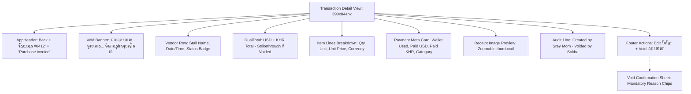
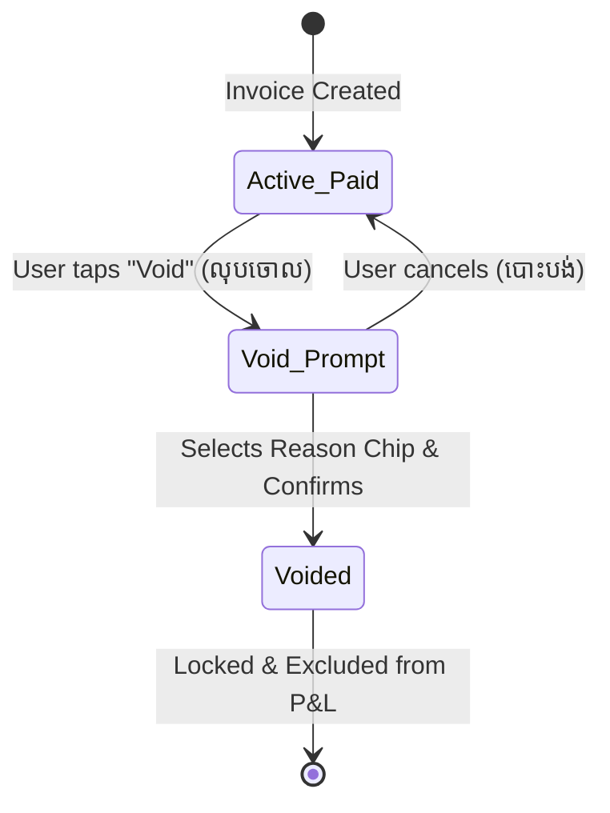

# FRD — Transaction Detail, Audit Trail & Soft-Void Engine
## Document Ref: `BONCHI-FRD-08`

- **System:** Bonchi Restaurant Money App
- **Module:** Transaction Detail, Immutable Audit & Soft-Void Protocol
- **Prototype Screen:** Screen 7 — `7 · ព័ត៌មានលម្អិត Transaction detail` (`7_Transaction_detail_unbundled.html`)
- **Companion PRD:** [Bonchi_Restaurant_Money_App_PRD.md](file:///d:/Bonchi%20System/Bonchi_Restaurant_Money_App_PRD.md#feature-8-transaction-ledger-details--soft-void-engine)

---

## 1. Feature Overview & Objectives
Any financial entry must be verifiable, auditable, and rectifiable without destroying historical data. This module governs the detailed breakdown of purchase invoices, stores attached receipt photos, tracks creator/editor identity, and executes soft-voids with mandatory justification.

---

## 2. UI/UX Wireframe & Layout



---

## 3. Soft-Void State Machine & Rules



### 3.1 Standardized Void Reasons
```javascript
var REASONS = [
  'បញ្ចូលខុស',             // Mistyped / erroneous price/qty
  'កត់ស្ទួន',               // Duplicate entry
  'អ្នកផ្គត់ផ្គង់ដកវិញ',      // Supplier cancelled / items returned
  'ផ្សេងៗ'                 // Other reason (requires text explanation)
];
```

### 3.2 Visual & Accounting Consequences of Voiding
1. **Red Warning Banner:** Displays prominent top banner:
   `បានលុបចោល · មូលហេតុ៖ {reason} · មិនរាប់ក្នុងសរុបទៀតទេ`.
2. **Visual Strikethrough:** Amount numbers receive class `.p-void` (faded opacity, strikethrough styling).
3. **Status Badge:** Updates from `paid` to `void` (`បានលុបចោល`).
4. **Action Buttons:** Edit and Void buttons disappear; invoice is permanently locked.
5. **Ledger Rollback:** Associated payments are marked void; the spent amount is credited back to the source wallet.

---

## 4. API Specification

### `POST /api/v1/invoices/:id/void`
- **Access:** Owner (Unrestricted), Manager (Own same-day entries)
- **Request Body:**
```json
{
  "reason": "បញ្ចូលខុស"
}
```
- **Response `200 OK`:**
```json
{
  "success": true,
  "invoice_id": "8f9b2b24-4f27-4c1d-9321-729481928001",
  "status": "void",
  "void_reason": "បញ្ចូលខុស",
  "voided_by": "u-sokha-mgr",
  "voided_at": "2026-10-05T08:15:00+07:00",
  "wallet_reversal": {
    "wallet_id": "w-petty",
    "refunded_usd": 47.00,
    "refunded_khr": 55000
  }
}
```
