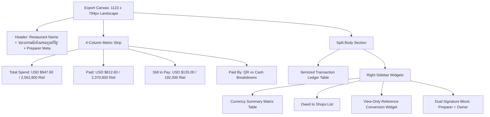
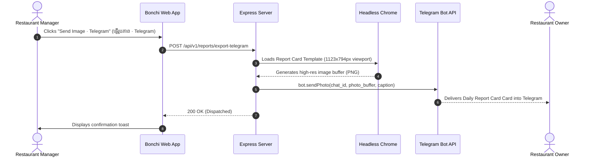

# FRD — Owner Daily Report Card & Multi-Channel Export
## Document Ref: `BONCHI-FRD-10`

- **System:** Bonchi Restaurant Money App
- **Module:** Executive Report Card Canvas & Multi-Channel Exporter
- **Prototype Screen:** Screen 9 — `9 · រូបភាពរបាយការណ៍ Export for owner` (`9_Export_for_owner_unbundled.html`)
- **Companion PRD:** [Bonchi_Restaurant_Money_App_PRD.md](file:///d:/Bonchi%20System/Bonchi_Restaurant_Money_App_PRD.md#feature-10-owner-daily-report-card--multi-channel-export)

---

## 1. Feature Overview & Objectives
Owners often manage their business remotely or require a standardized daily proof-of-operations delivered via messaging apps (Telegram) or exported to Excel. This module renders a high-definition, A4 landscape executive report card ($1123\text{px} \times 794\text{px}$) that summarizes daily expenditures, outstanding debts, and vendor line-items with dual signatures.

---

## 2. Canvas Specifications & Layout

---

## 3. Structural Components of the Report Card

### 3.1 4-Column Top Metric Strip
1. **Total Spend (`ចំណាយសរុប`):** `$947.60` USD | `2,562,800 ៛` KHR.
2. **Paid (`បានទូទាត់` - Green Accent):** `$812.60` USD | `2,370,800 ៛` KHR.
3. **Still to Pay (`ត្រូវបង់បន្ថែម` - Amber Accent):** `$135.00` USD | `192,000 ៛` KHR.
4. **Paid By (`បង់តាម`):**
   - QR: `$812.60` | `2,280,800 ៛`
   - Cash: `$0.00` | `90,000 ៛`

### 3.2 Itemized Transaction Ledger Table (`.r-t`)
Columns:
1. `#`: Sequential index.
2. `មុខទំនិញ`: Item Name (e.g. `ទឹកកក`, `សាច់គោ`, `Ganzberg snow`).
3. `ហាង`: Vendor / Stall (e.g. `ហាងទឹកកក សុខលី`, `ហាងសាច់ ផ្សារថ្មី`).
4. `ចំនួន`: Quantity with unit (e.g. `64 ការ៉ុង`, `4.754 គីឡូ`).
5. `តម្លៃរាយ`: Unit price (e.g. `3,000 ៛`, `$24.00`).
6. `បង់តាម`: Payment pill badge (`QR` = `.pill-qr`, `Cash` = `.pill-cash`, `! ជំពាក់` = `.pill-owe`).
7. `សរុប $`: Total in USD (or `—` if KHR line).
8. `សរុប ៛`: Total in KHR (or `—` if USD line).

### 3.3 Sidebar Widgets

#### A. Currency Summary Matrix (`.s-t`)
| Currency | Unpaid (`មិនទាន់ទូទាត់`) | Paid (`ទូទាត់រួច`) | Total (`សរុប`) |
| :--- | :--- | :--- | :--- |
| **USD ($)** | $135.00 | $812.60 | $947.60 |
| **KHR (៛)** | 192,000 ៛ | 2,370,800 ៛ | 2,562,800 ៛ |

#### B. Owed to Shops (`នៅជំពាក់ហាង`)
- `ហាងទឹកកក សុខលី`: `192,000 ៛`
- `ហាងភេសជ្ជៈ ដារ៉ា`: `$135.00`

#### C. View-Only Reference Conversion
- Label: `បម្លែងសរុប (អត្រា 4,000 ៛ = $1) ≈ 6,353,200 ៛`
- Disclaimer: `សម្រាប់មើលប៉ុណ្ណោះ · view only, not stored`.

#### D. Formal Signatures Block
Two signature boxes side-by-side with underline:
- Preparer (`អ្នករៀបចំ`)
- Owner (`ម្ចាស់ · Owner`)

---

## 4. Multi-Channel Export Drivers & API

### 4.1 Telegram Bot Delivery (`POST /api/v1/reports/export-telegram`)

### 4.2 Excel Export Generator (`GET /api/v1/reports/export-excel`)
Generates an `.xlsx` workbook using `exceljs`:
- Sheet 1: `Daily Summary` (Header, 4 metric cards, and currency matrix).
- Sheet 2: `Itemized Ledger` (Separate columns for USD and KHR amounts).
- Sheet 3: `Accounts Payable` (Itemized vendor debts).
