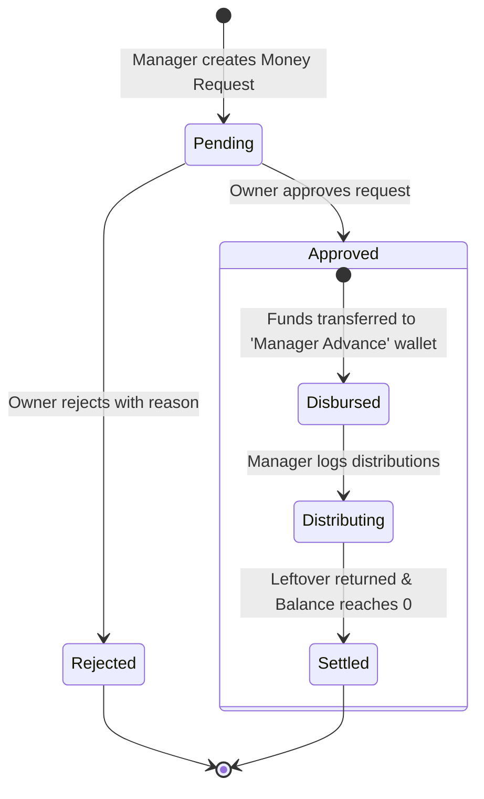

# FRD — Manager Money Requests & Advance Settlements
## Document Ref: `BONCHI-FRD-11`

- **System:** Bonchi Restaurant Money App
- **Module:** Manager Cash Advances & Itemized Distributions
- **Prototype Reference:** Tile 5 in `2_Add_sheet_unbundled.html` (`ស្នើសុំលុយ · Request money · អ្នកគ្រប់គ្រង`)
- **Companion PRD:** [Bonchi_Restaurant_Money_App_PRD.md](file:///d:/Bonchi%20System/Bonchi_Restaurant_Money_App_PRD.md#feature-11-manager-cash-advances--money-requests)

---

## 1. Feature Overview & Objectives
Managers routinely require cash advances to pay out monthly/weekly staff tips, settle emergency equipment repairs, or execute unplanned restaurant errands. Without a structured tracking mechanism, cash leaves the restaurant drawer and remains unaccounted for days. This module governs the formal request, owner authorization, itemized distribution, and zero-balance settlement of cash advances.

---

## 2. Advance Lifecycle State Machine



### 2.1 Step-by-Step Operational Flow
1. **Creation:** Manager fills Money Request form: Amount, Currency, Category (e.g. `Staff Tips` or `Repair`), and Reason.
2. **Authorization:** Owner receives push notification / dashboard alert and taps **Approve** or **Reject**.
3. **Fund Disbursement:** Upon approval, an automated transfer is created:
   - Source: Petty Cash or Cash Drawer.
   - Destination: `Manager Advance` wallet (`mgr`).
4. **Itemized Distribution:** Manager hands out cash to individual staff or service technicians and logs each line:
   - Recipient Name (e.g. `Bopha`, `Vannak`)
   - Amount ($ or ៛)
   - Timestamp & Purpose
5. **Zero-Balance Settlement:**
   - Any leftover cash is transferred back to Petty Cash.
   - When `Manager Advance` wallet balance returns to zero, the request status updates to `settled`.

---

## 3. Database Schema & Ledger Integration

Tables involved:
- `money_requests`
- `request_distributions`
- `transfers` (linked via `request_id`)
- `wallets` (`mgr` code)

$$\text{RemainingAdvance} = \text{ApprovedAmount} - \sum \text{Distributions} - \text{RefundedTransfer}$$

---

## 4. API Endpoints

### 4.1 `POST /api/v1/money-requests`
- **Access:** Manager, Owner
- **Request Body:**
```json
{
  "amount": 100.00,
  "currency": "USD",
  "category_id": "c-staff-bonus-tips",
  "reason": "Customer tips accumulated for kitchen staff"
}
```

### 4.2 `POST /api/v1/money-requests/:id/approve`
- **Access:** Owner Only
- **Request Body:**
```json
{
  "disburse_from_wallet_id": "w-drawer-id"
}
```
- **Action:** Changes status to `approved`, creates transfer from `disburse_from_wallet_id` to `Manager Advance` wallet.

### 4.3 `POST /api/v1/money-requests/:id/distribute`
- **Access:** Manager
- **Request Body:**
```json
{
  "recipient_name": "សុខណា (Cook)",
  "amount": 25.00,
  "currency": "USD",
  "note": "October tip distribution"
}
```
