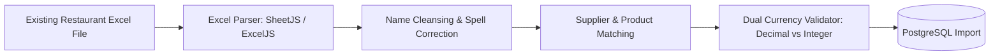

# FRD — Master Data Management & Initial Excel Migration
## Document Ref: `BONCHI-FRD-12`

- **System:** Bonchi Restaurant Money App
- **Module:** Master Catalogs, Wallets Setup & Legacy Excel Import
- **Companion PRD:** [Bonchi_Restaurant_Money_App_PRD.md](file:///d:/Bonchi%20System/Bonchi_Restaurant_Money_App_PRD.md#feature-13-master-data-management-suppliers-products-categories-wallets-users)

---

## 1. Feature Overview & Objectives
To ensure high data quality and eliminate inconsistent spelling (e.g. `សាច់មាន់` vs `សាច់មាន់ស្រែ` vs `Chicken`), the application enforces standard master catalogs for products, vendors, and expense categories. Additionally, an onboarding utility imports the restaurant's existing Excel sheets into Bonchi at launch.

---

## 2. Master Data Entities

### 2.1 Standard Product Catalog (`products`)
- Fields: `name`, `default_unit`, `category_id`, `default_currency`, `default_unit_price`.
- Standard Units Supported:
  - Weight: `គីឡូ` (Kg), `ក្រាម` (g)
  - Volume/Packaging: `ដប` (Bottle), `កំប៉ុង` (Can), `កេស` (Case/Carton), `កញ្ចប់` (Pack)
  - Unit count: `គ្រាប់` (Egg/Piece), `ការ៉ុង` (Bag/Sack), `ធុង` (Cylinder/Barrel)

### 2.2 Suppliers / Stalls Catalog (`suppliers`)
- Pre-populated wet market vendors with stall locations (e.g. `ផ្សារថ្មី`, `ផ្សារដើមគរ`).
- Credit status indicator: Tracks whether stall allows deferred payment (`unpaid` / credit) or requires cash/ABA QR on the spot.

### 2.3 Hierarchical Expense Categories (`categories`)
```
Food & Drink (ម្ហូប និងភេសជ្ជៈ)
  ├── Ingredients (គ្រឿងផ្សំ)
  ├── Drinks (ភេសជ្ជៈ)
  ├── Ice (ទឹកកក)
  └── Gas (ហ្គាស)
Staff (បុគ្គលិក)
  ├── Salary (ប្រាក់ខែ)
  ├── Bonus / Tips (ប្រាក់លើកទឹកចិត្ត និងធីប)
  └── Staff Meals (អាហារបុគ្គលិក)
Operations (ប្រតិបត្តិការ)
  ├── Rent (ថ្លៃជួលទីតាំង)
  ├── Electricity (ថ្លៃភ្លើង)
  ├── Water (ថ្លៃទឹក)
  └── Internet (ថ្លៃអ៊ីនធឺណិត)
Repair & Maintenance (ជួសជុល និងថែទាំ)
  ├── Kitchen Equipment (សម្ភារៈផ្ទះបាយ)
  ├── Building (អគារ និងប្រព័ន្ធទឹកភ្លើង)
  ├── Furniture (តុ កៅអី)
  └── Air Conditioner (ម៉ាស៊ីនត្រជាក់)
Other (ផ្សេងៗ)
  ├── Marketing (ផ្សព្វផ្សាយ)
  ├── Delivery Fees (សេវាដឹកជញ្ជូន)
  ├── Supplies (សម្ភារៈប្រើប្រាស់)
  └── Other (ផ្សេងៗ)
```

---

## 3. Legacy Excel Data Import Pipeline

### 3.1 Migration Workflow


### 3.2 Excel Column Mapping
| Excel Column | Bonchi Table | Field Target | Transformation Rule |
| :--- | :--- | :--- | :--- |
| `Date` | `invoices` | `invoice_date` | Parse ISO `YYYY-MM-DD` |
| `Vendor / Shop` | `suppliers` | `name` | Fuzzy match or create new |
| `Item Name` | `invoice_items` | `item_name` | Matched with `products.name` |
| `Qty` | `invoice_items` | `quantity` | Numeric cast |
| `Unit` | `invoice_items` | `unit` | Standard unit mapping |
| `Currency` | `invoice_items` | `currency` | Enforce `'USD'` or `'KHR'` |
| `Unit Price` | `invoice_items` | `unit_price` | Clean non-numerics |
| `Paid From` | `invoice_payments`| `wallet_id` | Match wallet code |

---

## 4. API Specification

### `POST /api/v1/admin/import-excel`
- **Access:** Owner Only
- **Content-Type:** `multipart/form-data`
- **Body:** `file: <legacy_expenses.xlsx>`
- **Response `200 OK`:**
```json
{
  "success": true,
  "imported_rows": 482,
  "invoices_created": 154,
  "suppliers_created": 18,
  "products_created": 64,
  "unresolved_errors": []
}
```
