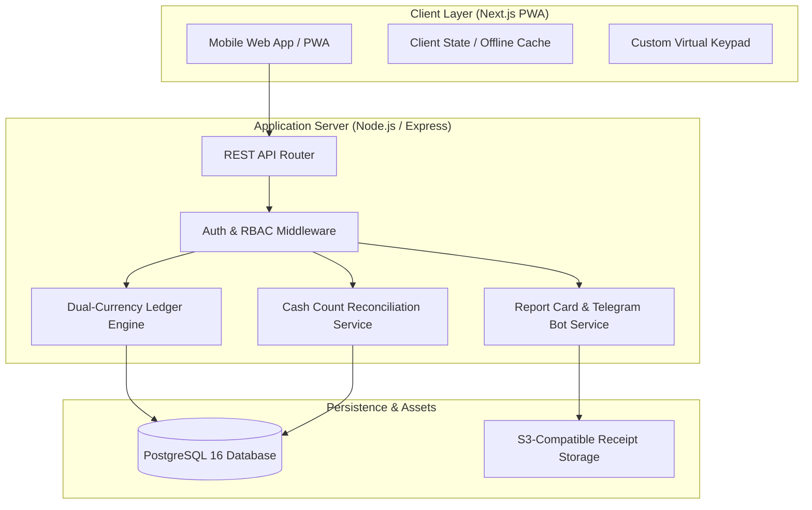
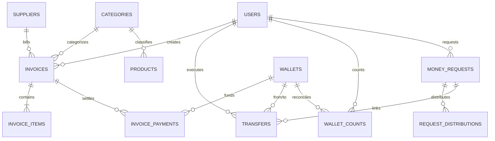
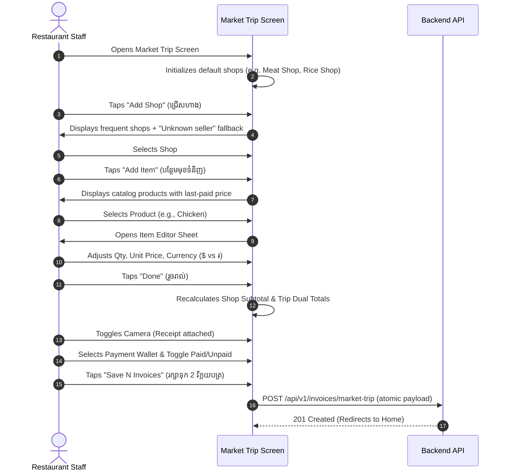
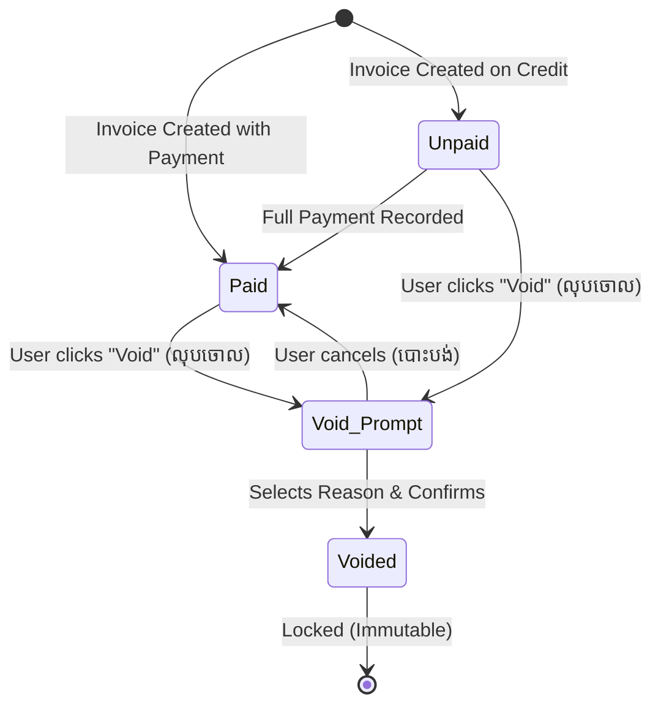

# Functional Requirements Document (FRD)
## Bonchi — Restaurant Income & Expense Management System (Dual Currency USD/KHR)

- **System Identifier:** BONCHI-RMS-v1.0
- **Version:** 1.0.0
- **Target Tech Stack:** Next.js (Frontend) + Express / Node.js (Backend) + PostgreSQL (Database) + S3 (Object Storage)
- **Document Date:** October 5, 2026
- **Companion Document:** [Bonchi_Restaurant_Money_App_PRD.md](file:///d:/Bonchi%20System/docs/Bonchi_Restaurant_Money_App_PRD.md)
- **Prototype Reference:** [Bonchi — Restaurant Money App.html](file:///d:/Bonchi%20System/Bonchi%20%E2%80%94%20Restaurant%20Money%20App.html)

---

## 1. System Architecture & Tech Stack



### 1.1 Architectural Decisions
1. **Frontend:** Next.js (React 19) configured as an offline-capable Progressive Web Application (PWA) with client-side optimistic updates for mobile form entry.
2. **Backend:** Node.js with Express framework exposing a stateless, versioned RESTful API (`/api/v1/*`).
3. **Database:** PostgreSQL 16 utilizing strict constraints, foreign keys, and atomic database transactions (`BEGIN...COMMIT`) for all wallet mutations.
4. **Receipt Storage:** S3-compatible cloud bucket storing image assets compressed client-side (JPEG/WebP, max 800px width, < 300KB).

---

## 2. Relational Database Schema & Data Dictionary

All monetary fields enforce strict segregation. Currency code is an `ENUM('USD', 'KHR')`.
- `USD` amounts use `DECIMAL(12,2)` (e.g. `947.60`).
- `KHR` amounts use `DECIMAL(14,0)` (e.g. `2562800`).



### 2.1 Complete SQL DDL Definitions

```sql
-- 1. Users & Roles
CREATE TYPE user_role AS ENUM ('owner', 'manager', 'staff');

CREATE TABLE users (
    id BIGINT GENERATED BY DEFAULT AS IDENTITY PRIMARY KEY,
    username VARCHAR(100) UNIQUE NOT NULL,
    name VARCHAR(100) NOT NULL,
    phone VARCHAR(20),
    password_hash VARCHAR(255) NOT NULL,
    role user_role NOT NULL DEFAULT 'staff',
    is_active BOOLEAN NOT NULL DEFAULT true,
    created_at TIMESTAMPTZ NOT NULL DEFAULT NOW(),
    updated_at TIMESTAMPTZ NOT NULL DEFAULT NOW()
);

-- 2. Financial Categories
CREATE TYPE category_type AS ENUM ('income', 'expense');

CREATE TABLE categories (
    id BIGINT GENERATED BY DEFAULT AS IDENTITY PRIMARY KEY,
    name_km VARCHAR(100) NOT NULL,
    name_en VARCHAR(100),
    type category_type NOT NULL,
    parent_id BIGINT REFERENCES categories(id) ON DELETE SET NULL,
    icon VARCHAR(50),
    is_active BOOLEAN NOT NULL DEFAULT true
);

-- 3. Suppliers / Stalls / Vendors
CREATE TABLE suppliers (
    id BIGINT GENERATED BY DEFAULT AS IDENTITY PRIMARY KEY,
    name VARCHAR(150) NOT NULL,
    market_location VARCHAR(100), -- e.g. 'ផ្សារថ្មី', 'ផ្សារដើមគរ'
    contact_phone VARCHAR(50),
    note TEXT,
    is_active BOOLEAN NOT NULL DEFAULT true,
    created_at TIMESTAMPTZ NOT NULL DEFAULT NOW()
);

-- 4. Standard Products Catalog
CREATE TABLE products (
    id BIGINT GENERATED BY DEFAULT AS IDENTITY PRIMARY KEY,
    name VARCHAR(150) NOT NULL,
    default_unit VARCHAR(50) NOT NULL, -- e.g. 'គីឡូ', 'ដប', 'គ្រាប់', 'កេស'
    category_id BIGINT REFERENCES categories(id) ON DELETE RESTRICT,
    default_currency VARCHAR(3) CHECK (default_currency IN ('USD', 'KHR')),
    default_unit_price DECIMAL(14,2) DEFAULT 0,
    is_active BOOLEAN NOT NULL DEFAULT true
);

-- 5. Wallets & Bank Accounts
CREATE TYPE wallet_type AS ENUM ('cash_drawer', 'petty_cash', 'bank', 'delivery_app', 'staff_advance', 'manager_advance', 'tips');

CREATE TABLE wallets (
    id BIGINT GENERATED BY DEFAULT AS IDENTITY PRIMARY KEY,
    code VARCHAR(50) UNIQUE NOT NULL, -- e.g. 'drawer', 'petty', 'aba', 'mgr'
    name_km VARCHAR(100) NOT NULL,
    name_en VARCHAR(100) NOT NULL,
    type wallet_type NOT NULL,
    opening_usd DECIMAL(12,2) NOT NULL DEFAULT 0.00,
    opening_khr DECIMAL(14,0) NOT NULL DEFAULT 0,
    current_usd DECIMAL(12,2) NOT NULL DEFAULT 0.00,
    current_khr DECIMAL(14,0) NOT NULL DEFAULT 0,
    is_active BOOLEAN NOT NULL DEFAULT true,
    created_at TIMESTAMPTZ NOT NULL DEFAULT NOW()
);

-- 6. Invoices (Income and Expense Master)
CREATE TYPE invoice_type AS ENUM ('expense', 'income');
CREATE TYPE expense_kind AS ENUM ('product', 'small');
CREATE TYPE invoice_status AS ENUM ('paid', 'partial', 'unpaid', 'void');

CREATE TABLE invoices (
    id BIGINT GENERATED BY DEFAULT AS IDENTITY PRIMARY KEY,
    invoice_no VARCHAR(50) UNIQUE NOT NULL, -- e.g. 'INV-20261005-0412'
    invoice_date DATE NOT NULL DEFAULT CURRENT_DATE,
    invoice_time TIME NOT NULL DEFAULT CURRENT_TIME,
    type invoice_type NOT NULL DEFAULT 'expense',
    expense_kind expense_kind,
    market_trip_id BIGINT, -- groups batch purchases from same market trip
    supplier_id BIGINT REFERENCES suppliers(id) ON DELETE RESTRICT,
    category_id BIGINT REFERENCES categories(id) ON DELETE RESTRICT,
    total_usd DECIMAL(12,2) NOT NULL DEFAULT 0.00,
    total_khr DECIMAL(14,0) NOT NULL DEFAULT 0,
    status invoice_status NOT NULL DEFAULT 'paid',
    void_reason VARCHAR(100),
    voided_by BIGINT REFERENCES users(id),
    voided_at TIMESTAMPTZ,
    receipt_url TEXT,
    note TEXT,
    created_by BIGINT NOT NULL REFERENCES users(id),
    created_at TIMESTAMPTZ NOT NULL DEFAULT NOW(),
    updated_at TIMESTAMPTZ NOT NULL DEFAULT NOW()
);

-- 7. Invoice Item Lines
CREATE TABLE invoice_items (
    id BIGINT GENERATED BY DEFAULT AS IDENTITY PRIMARY KEY,
    invoice_id BIGINT NOT NULL REFERENCES invoices(id) ON DELETE CASCADE,
    product_id BIGINT REFERENCES products(id) ON DELETE RESTRICT,
    item_name VARCHAR(150) NOT NULL,
    quantity DECIMAL(10,3) NOT NULL CHECK (quantity > 0),
    unit VARCHAR(50) NOT NULL,
    unit_price DECIMAL(14,2) NOT NULL CHECK (unit_price >= 0),
    currency VARCHAR(3) NOT NULL CHECK (currency IN ('USD', 'KHR')),
    line_total DECIMAL(14,2) NOT NULL CHECK (line_total >= 0),
    created_at TIMESTAMPTZ NOT NULL DEFAULT NOW()
);

-- 8. Invoice Payments Ledger
CREATE TYPE payment_method AS ENUM ('cash', 'qr', 'bank_transfer', 'credit');

CREATE TABLE invoice_payments (
    id BIGINT GENERATED BY DEFAULT AS IDENTITY PRIMARY KEY,
    invoice_id BIGINT NOT NULL REFERENCES invoices(id) ON DELETE CASCADE,
    wallet_id BIGINT NOT NULL REFERENCES wallets(id) ON DELETE RESTRICT,
    amount DECIMAL(14,2) NOT NULL CHECK (amount > 0),
    currency VARCHAR(3) NOT NULL CHECK (currency IN ('USD', 'KHR')),
    method payment_method NOT NULL DEFAULT 'cash',
    cross_currency_rate DECIMAL(10,4), -- only populated if paid across currency
    paid_at TIMESTAMPTZ NOT NULL DEFAULT NOW(),
    created_by BIGINT NOT NULL REFERENCES users(id)
);

-- 9. Internal Wallet-to-Wallet Transfers
CREATE TABLE transfers (
    id BIGINT GENERATED BY DEFAULT AS IDENTITY PRIMARY KEY,
    transfer_date DATE NOT NULL DEFAULT CURRENT_DATE,
    from_wallet_id BIGINT NOT NULL REFERENCES wallets(id) ON DELETE RESTRICT,
    to_wallet_id BIGINT NOT NULL REFERENCES wallets(id) ON DELETE RESTRICT,
    amount DECIMAL(14,2) NOT NULL CHECK (amount > 0),
    currency VARCHAR(3) NOT NULL CHECK (currency IN ('USD', 'KHR')),
    note TEXT,
    request_id BIGINT, -- optional reference to approved money_requests
    created_by BIGINT NOT NULL REFERENCES users(id),
    created_at TIMESTAMPTZ NOT NULL DEFAULT NOW(),
    CONSTRAINT check_different_wallets CHECK (from_wallet_id <> to_wallet_id)
);

-- 10. End-of-Day Shift Cash Reconciliation Counts
CREATE TABLE wallet_counts (
    id BIGINT GENERATED BY DEFAULT AS IDENTITY PRIMARY KEY,
    wallet_id BIGINT NOT NULL REFERENCES wallets(id) ON DELETE RESTRICT,
    currency VARCHAR(3) NOT NULL CHECK (currency IN ('USD', 'KHR')),
    count_date DATE NOT NULL DEFAULT CURRENT_DATE,
    system_amount DECIMAL(14,2) NOT NULL,
    counted_amount DECIMAL(14,2) NOT NULL,
    difference DECIMAL(14,2) GENERATED ALWAYS AS (counted_amount - system_amount) STORED,
    tolerance_threshold DECIMAL(14,2) NOT NULL,
    denominations_breakdown JSONB NOT NULL, -- e.g. {"100000": 2, "50000": 3}
    reason_for_gap TEXT,
    is_blind_count BOOLEAN NOT NULL DEFAULT true,
    counted_by BIGINT NOT NULL REFERENCES users(id),
    verified_by BIGINT REFERENCES users(id),
    created_at TIMESTAMPTZ NOT NULL DEFAULT NOW()
);

-- 11. Manager Cash Advance Requests
CREATE TYPE request_status AS ENUM ('pending', 'approved', 'rejected', 'settled');

CREATE TABLE money_requests (
    id BIGINT GENERATED BY DEFAULT AS IDENTITY PRIMARY KEY,
    requested_by BIGINT NOT NULL REFERENCES users(id),
    amount DECIMAL(14,2) NOT NULL CHECK (amount > 0),
    currency VARCHAR(3) NOT NULL CHECK (currency IN ('USD', 'KHR')),
    category_id BIGINT REFERENCES categories(id) ON DELETE RESTRICT,
    reason TEXT NOT NULL,
    status request_status NOT NULL DEFAULT 'pending',
    approved_by BIGINT REFERENCES users(id),
    approved_at TIMESTAMPTZ,
    rejection_reason TEXT,
    created_at TIMESTAMPTZ NOT NULL DEFAULT NOW()
);

-- 12. Cash Request Itemized Distributions
CREATE TABLE request_distributions (
    id BIGINT GENERATED BY DEFAULT AS IDENTITY PRIMARY KEY,
    request_id BIGINT NOT NULL REFERENCES money_requests(id) ON DELETE CASCADE,
    recipient_name VARCHAR(100) NOT NULL,
    amount DECIMAL(14,2) NOT NULL CHECK (amount > 0),
    currency VARCHAR(3) NOT NULL CHECK (currency IN ('USD', 'KHR')),
    given_at TIMESTAMPTZ NOT NULL DEFAULT NOW(),
    note TEXT
);

-- 13. System Audit Log
CREATE TABLE audit_log (
    id BIGINT GENERATED BY DEFAULT AS IDENTITY PRIMARY KEY,
    table_name VARCHAR(50) NOT NULL,
    record_id BIGINT NOT NULL,
    action VARCHAR(20) NOT NULL, -- 'INSERT', 'UPDATE', 'VOID'
    old_value JSONB,
    new_value JSONB,
    user_id BIGINT NOT NULL REFERENCES users(id),
    created_at TIMESTAMPTZ NOT NULL DEFAULT NOW()
);

-- Indexes for High Velocity Retrieval
CREATE INDEX idx_invoices_date ON invoices(invoice_date);
CREATE INDEX idx_invoices_status ON invoices(status);
CREATE INDEX idx_invoices_supplier ON invoices(supplier_id);
CREATE INDEX idx_transfers_date ON transfers(transfer_date);
CREATE INDEX idx_wallet_counts_date ON wallet_counts(count_date);
CREATE INDEX idx_audit_record ON audit_log(table_name, record_id);
```

---

## 3. Granular Functional Specifications by Module

### Module 1: Home Dashboard & Real-Time Wallet Balance Engine
*(Corresponds to Prototype Screen 1 — `1_Home_unbundled.html`)*

#### 1.1 Wireframe Component Hierarchy
- `AppHeader`: Displays current day (`ថ្ងៃនេះ`), long date in Khmer (`ច័ន្ទ 5 តុលា 2026`), role badge (`ម្ចាស់` or `បុគ្គលិក`), and search icon button.
- `ClosingAlertBanner`: Warning style status banner with alert icon, text `មិនទាន់រាប់លុយថ្ងៃនេះ · បិទហាងម៉ោង 21:00`, and direct navigation button `រាប់ឥឡូវ` (`DailyCount.dc.html`).
- `DualTotalWidget`:
  - If Owner: 2 stacked dual total cards:
    - Today's Income (`ចំណូលថ្ងៃនេះ · Income`): USD $412.50 + KHR 1,280,000 ៛.
    - Today's Expense (`ចំណាយថ្ងៃនេះ · Expense`): USD $96.00 + KHR 185,000 ៛.
  - If Staff: Single dual total card:
    - My spending today (`ខ្ញុំបានចាយថ្ងៃនេះ · My spending today`): USD $47.00 + KHR 63,000 ៛.
- `WalletsCarousel`:
  - Section title: `កាបូប` with right link `ទាំងអស់`.
  - Horizontal scrolling flex deck (card min-width `220px`):
    - Cash Drawer (`ថតលុយ · Cash drawer`): USD $186.00, KHR 420,000 ៛ (Hidden for Staff).
    - Petty Cash (`លុយចាយប្រចាំថ្ងៃ · Petty cash`): USD $40.00, KHR 95,000 ៛ (Visible to all).
    - ABA Bank (`ABA · Bank`): USD $1,240.55, KHR 0 ៛ (Hidden for Staff).
- `RecentTransactionsList`:
  - Section title: `ប្រតិបត្តិការថ្មីៗ`.
  - Transaction rows linking to `Detail.dc.html`.
- `BottomNavigation`:
  - 5-column fixed footer: Owner vs Staff routing.

#### 1.2 Mathematical Balance Calculation Engine
The live balance of any wallet $W$ for currency $C \in \{\text{USD}, \text{KHR}\}$ is computed deterministically as:
$$\text{Balance}(W, C) = \text{Opening}(W, C) + \sum \text{Inflow}(W, C) - \sum \text{Outflow}(W, C)$$

Where:
$$\text{Inflow}(W, C) = \text{PaymentsReceived}(W, C) + \text{TransfersIn}(W, C)$$
$$\text{Outflow}(W, C) = \text{PaymentsMade}(W, C) + \text{TransfersOut}(W, C)$$

*Rule: Any transaction with `status = 'void'` is strictly multiplied by 0 in the aggregation.*

---

### Module 2: Add Sheet Modal Dispatcher
*(Corresponds to Prototype Screen 2 — `2_Add_sheet_unbundled.html`)*

#### 2.1 UI Layout & Dispatch Matrix
- Backdrop: `p-scrim` semi-transparent dismissal barrier.
- Sheet Dialog: Bottom modal with top grab bar (`p-grab`), header title (`កត់ត្រាថ្មី`), subtitle (`What do you want to record?`), and close `x` icon.
- Action Dispatch Buttons:

| Button | Khmer Label | English Subtitle | Destination Target | Theme Accent |
| :--- | :--- | :--- | :--- | :--- |
| **Tile 1** | ទិញទំនិញ | Product purchase | `Purchase.dc.html` | Red Cart Disc |
| **Tile 2** | ចំណាយតូចតាច | Small expense | `SmallExpense.dc.html` | Red Coins Disc |
| **Tile 3** | ចំណូល | Income | `IncomeForm` | Green Income Disc |
| **Tile 4** | ផ្ទេរប្រាក់ | Transfer | `Transfer.dc.html` | Blue Transfer Disc |
| **Full Row Tile** | ស្នើសុំលុយ | Request money · អ្នកគ្រប់គ្រង | `MoneyRequestForm` | Gold Request Disc |

- Footer Metadata: `ចុងក្រោយ៖ {last_invoice.shop} · {last_invoice.time}` (e.g. `ចុងក្រោយ៖ ទិញនៅផ្សារថ្មី · 07:40`).

---

### Module 3: Market Trip & Multi-Shop Invoicing
*(Corresponds to Prototype Screen 3 — `3_Product_purchase_unbundled.html`)*

#### 3.1 Workflow Sequence


#### 3.2 State Structure & Component Functions
- `shops`: Array of shop objects:
  ```json
  [
    {
      "id": 1,
      "name": "ហាងសាច់ ផ្សារថ្មី",
      "photo": true,
      "items": [
        { "id": 1, "name": "សាច់មាន់", "unit": "គីឡូ", "qty": 10, "price": 3.5, "cur": "USD", "last": 3.5 }
      ]
    },
    {
      "id": 2,
      "name": "ហាងអង្ករ មីងស្រី",
      "photo": false,
      "items": [
        { "id": 2, "name": "អង្ករ", "unit": "គីឡូ", "qty": 25, "price": 2200, "cur": "KHR", "last": 2200 },
        { "id": 3, "name": "ប្រេងឆា", "unit": "ដប", "price": 6, "qty": 2, "cur": "USD", "last": 6 }
      ]
    }
  ]
  ```
- **Validation Rules:**
  1. `qty` must be a positive number $> 0$.
  2. `price` must be $\ge 0$. If `currency == 'KHR'`, `price` must be an integer.
  3. A shop with 0 items is omitted upon saving.
  4. Save button `saveCls` is disabled (`p-btn-off`) if `invoiceCount == 0`.

---

### Module 4: Rapid Small Expense Form with Specialized Keypad
*(Corresponds to Prototype Screen 4 — `4_Small_expense_unbundled.html`)*

#### 4.1 UI Layout & Dedicated Keypad Spec
1. **Segmented Currency Switcher:** `$ ដុល្លារ` vs `៛ រៀល`.
2. **Dynamic Amount Display:** Large typography formatted with commas:
   - If USD: `$15.50`
   - If KHR: `8,000 ៛`
3. **Quick Increment Chips Math:**
   - KHR Chips: `+1,000`, `+5,000`, `+10,000`, `+50,000`.
   - USD Chips: `+$1`, `+$5`, `+$10`, `+$20`.
   - Math: Adds value directly to active numeric string and re-formats.
4. **Category Quick Chips:**
   `['ទឹកកក', 'ហ្គាស', 'ក្រដាសអនាម័យ', 'សាប៊ូ', 'ម៉ូតូឌុប', 'ធ្យូង', 'ផ្សេងៗ']`.
   Selecting a chip sets `state.pick`.
5. **Specialized Virtual Keypad:**
   - Grid layout: 4 rows × 3 columns.
   - Keys:
     - Row 1: `1`, `2`, `3`
     - Row 2: `4`, `5`, `6`
     - Row 3: `7`, `8`, `9`
     - Row 4: `000` (in KHR mode) / `.` (in USD mode), `0`, `⌫` (Backspace).
6. **Input Sanitization Logic:**
   - In KHR mode: leading zeros stripped (`replace(/^0+/, '')`), decimal blocked.
   - In USD mode: maximum one decimal point allowed; max 2 decimal places after point.
   - Max length: 9 digits.

---

### Module 5: Wallet-to-Wallet Fund Transfers
*(Corresponds to Prototype Screen 5 — `5_Transfer_unbundled.html`)*

#### 5.1 Validation & Execution Rules
1. **Source & Destination Differentiation:**
   - Wallet lists generated dynamically: `list('from')` and `list('to')`.
   - The selected `from` wallet is disabled in the `to` list, and vice versa.
2. **Swap Mechanism:** Tapping `swap` button inverts `from` and `to` IDs.
3. **Over-Balance Enforcement:**
   $$\text{isOver} = \text{TransferAmount} > \text{WalletBalance}_{\text{from}}[\text{SelectedCurrency}]$$
   - If `isOver == true`: Display warning banner `លើសពីលុយដែលមានក្នុង {fromName}`, disable transfer button (`p-btn-off`).
4. **Transfer Confirmation Banner:**
   Shows formatted summary: `ផ្ទេរ {formattedAmount} ពី {fromName} ទៅ {toName}`.

---

### Module 6: End-of-Day Blind Cash Count & Reconciliation
*(Corresponds to Prototype Screen 6 — `6_Daily_count_unbundled.html`)*

#### 6.1 Denomination Matrix & Calculation Logic

| Currency | Banknote Denominations Supported |
| :--- | :--- |
| **KHR (៛)** | 100,000 ៛, 50,000 ៛, 20,000 ៛, 10,000 ៛, 5,000 ៛, 1,000 ៛, 500 ៛ |
| **USD ($)** | $100, $50, $20, $10, $5, $1 |

- **Stepper Operations:**
  - `+` increases banknote count by 1.
  - `−` decreases banknote count by 1 (minimum 0).
  - Subtotal per row: $\text{Denomination} \times \text{Count}$.
  - Currency Counted Total: $\sum (\text{Denomination}_i \times \text{Count}_i)$.

#### 6.2 Blind Reconciliation Flow
1. Staff executes count with `blindCount = true`. System amounts (`SYSTEM.KHR = 420000`, `SYSTEM.USD = 186`) remain hidden.
2. Staff taps `ពិនិត្យជាមួយប្រព័ន្ធ` (`reveal()`).
3. System reveals `Bonchi.CountResult` widget:
   - Counted: e.g., 410,000 ៛
   - System: 420,000 ៛
   - Difference: -10,000 ៛ (Shortage)
4. Tolerance Evaluation:
   - Thresholds: `TOL.KHR = 10000`, `TOL.USD = 2.00`.
   - If $|\text{Difference}| > \text{Tolerance}$:
     - Reason field becomes mandatory (`reasonHint = 'ត្រូវការ · ម្ចាស់នឹងទទួលដំណឹង'`).
     - System triggers alert payload to Owner.

---

### Module 7: Transaction Detail, Audit Trail & Soft-Void State Machine
*(Corresponds to Prototype Screen 7 — `7_Transaction_detail_unbundled.html`)*

#### 7.1 State Machine Diagram


#### 7.2 Void Execution Protocol
1. **Mandatory Reasons:**
   - `បញ្ចូលខុស` (Mistyped data)
   - `កត់ស្ទួន` (Duplicate transaction)
   - `អ្នកផ្គត់ផ្គង់ដកវិញ` (Supplier returned/cancelled)
   - `ផ្សេងៗ` (Other reason)
2. **Database Mutation:**
   - `invoices.status` becomes `'void'`.
   - `invoices.void_reason` records selected reason.
   - `invoices.voided_by` records authenticated user ID.
   - `invoices.voided_at` records `NOW()`.
   - Insert row into `audit_log`.
   - Wallet balances recalculated atomically (undoes payment effect).

---

### Module 8: Multi-Period Analytics & Reporting
*(Corresponds to Prototype Screen 8 — `8_Reports_unbundled.html`)*

#### 8.1 Reporting Periods & Aggregation Queries
- Filter Chips: `today` (ថ្ងៃនេះ), `yesterday` (ម្សិលមិញ), `week` (សប្តាហ៍នេះ), `month` (ខែនេះ).
- **Aggregations:**
  1. `Total Spend`: $\sum \text{invoices.total\_usd}$ and $\sum \text{invoices.total\_khr}$ where `status != 'void'`.
  2. `Paid Amount`: $\sum \text{invoice\_payments.amount}$ grouped by currency.
  3. `Still to Pay (Accounts Payable)`: Total spend minus Paid amount for unpaid/partial invoices.
  4. `Payment Method Breakdown`: Sum grouped by `payment_method` (`qr` vs `cash`).

---

### Module 9: Owner Daily Report Card & Multi-Channel Export
*(Corresponds to Prototype Screen 9 — `9_Export_for_owner_unbundled.html`)*

#### 9.1 Landscape Document Specifications
- Container Canvas: Fixed $1123\text{px} \times 794\text{px}$ (ISO A4 Landscape Aspect Ratio at 96 DPI).
- Visual Sections:
  1. **Header:** Title `របាយការណ៍ចំណាយប្រចាំថ្ងៃ` (Daily Expense Report), restaurant name, date, preparer name (`រៀបចំដោយ ស្រីមុំ · 18:30`), and summary pills (`11 មុខ · 7 ហាង · 2 មិនទាន់ទូទាត់`).
  2. **Top Metric Cards (4 Grid):**
     - Total spend: USD $947.60, KHR 2,562,800 ៛.
     - Paid: USD $812.60, KHR 2,370,800 ៛ (Green).
     - Still to pay: USD $135.00, KHR 192,000 ៛ (Warning Amber).
     - Paid by method: QR ($812.60 / 2,280,800 ៛) vs Cash ($0.00 / 90,000 ៛).
  3. **Itemized Transaction Ledger:** Columns `#`, Item, Shop, Qty, Unit Price, Method Pill (`QR`, `Cash`, `! ជំពាក់`), Total USD, Total KHR.
  4. **Currency Summary Matrix:** Dual-entry table for USD and KHR across Unpaid, Paid, and Total.
  5. **Accounts Payable (Owed to Shops):** Itemized vendor debts (e.g. Sokly Ice: 192,000 ៛; Dara Beverage: $135.00).
  6. **View-Only Reference Conversion:**
     `បម្លែងសរុប (អត្រា 4,000 ៛ = $1) ≈ 6,353,200 ៛` labeled `សម្រាប់មើលប៉ុណ្ណោះ · view only, not stored`.
  7. **Signatures Block:** Preparer (`អ្នករៀបចំ`) and Owner (`ម្ចាស់ · Owner`).

#### 9.2 Export Implementation Drivers
- **Save PNG:** Client-side HTML5 canvas rasterization (`html2canvas` or Puppeteer on server) rendering high-resolution PNG.
- **Telegram Dispatch:** Server calls Telegram Bot API `sendPhoto` with generated PNG snapshot and markdown caption sent directly to Owner's Telegram chat.
- **Download Excel:** Uses `exceljs` generating formatted workbook with two separate columns for USD and KHR.

---

## 4. RESTful API Specifications

All endpoints require `Authorization: Bearer <JWT>` header.

### 4.1 Invoices Endpoints

#### `POST /api/v1/invoices/market-trip`
Creates a batch of invoices from a single market trip run.
- **Access:** Owner, Manager, Staff
- **Request Body:**
```json
{
  "trip_date": "2026-10-05",
  "wallet_id": "8f9b2b24-4f27-4c1d-9321-729481928001",
  "is_paid": true,
  "shops": [
    {
      "supplier_name": "ហាងសាច់ ផ្សារថ្មី",
      "receipt_url": "https://s3.ap-southeast-1.amazonaws.com/bonchi/receipts/rec-01.jpg",
      "items": [
        {
          "product_name": "សាច់មាន់",
          "quantity": 10.0,
          "unit": "គីឡូ",
          "unit_price": 3.50,
          "currency": "USD"
        }
      ]
    },
    {
      "supplier_name": "ហាងអង្ករ មីងស្រី",
      "receipt_url": null,
      "items": [
        {
          "product_name": "អង្ករ",
          "quantity": 25.0,
          "unit": "គីឡូ",
          "unit_price": 2200,
          "currency": "KHR"
        },
        {
          "product_name": "ប្រេងឆា",
          "quantity": 2.0,
          "unit": "ដប",
          "unit_price": 6.00,
          "currency": "USD"
        }
      ]
    }
  ]
}
```
- **Response `201 Created`:**
```json
{
  "success": true,
  "trip_id": "a1b2c3d4-0001-4000-8000-abcdef123456",
  "invoices_created": 2,
  "invoices": [
    { "invoice_no": "INV-20261005-0412", "supplier": "ហាងសាច់ ផ្សារថ្មី", "total_usd": 35.00, "total_khr": 0 },
    { "invoice_no": "INV-20261005-0413", "supplier": "ហាងអង្ករ មីងស្រី", "total_usd": 12.00, "total_khr": 55000 }
  ]
}
```

#### `POST /api/v1/invoices/small-expense`
- **Access:** Owner, Manager, Staff
- **Request Body:**
```json
{
  "amount": 8000,
  "currency": "KHR",
  "category_name": "ទឹកកក",
  "wallet_id": "8f9b2b24-4f27-4c1d-9321-729481928002",
  "note": "Ice morning delivery"
}
```

#### `POST /api/v1/invoices/:id/void`
- **Access:** Owner, Manager (Same-day entries)
- **Request Body:**
```json
{
  "reason": "បញ្ចូលខុស"
}
```

---

### 4.2 Transfers & Daily Count Endpoints

#### `POST /api/v1/transfers`
- **Access:** Owner, Manager
- **Request Body:**
```json
{
  "from_wallet_id": "8f9b2b24-4f27-4c1d-9321-729481928001",
  "to_wallet_id": "8f9b2b24-4f27-4c1d-9321-729481928002",
  "amount": 100.00,
  "currency": "USD",
  "note": "Top up petty cash from drawer"
}
```

#### `POST /api/v1/wallet-counts`
- **Access:** Owner, Manager, Staff
- **Request Body:**
```json
{
  "wallet_id": "8f9b2b24-4f27-4c1d-9321-729481928001",
  "currency": "KHR",
  "denominations": {
    "100000": 2,
    "50000": 3,
    "20000": 2,
    "10000": 2,
    "5000": 1
  },
  "reason_for_gap": "អាប់លុយខុសម្នាក់"
}
```
- **Response `200 OK`:**
```json
{
  "system_amount": 420000,
  "counted_amount": 415000,
  "difference": -5000,
  "within_tolerance": true,
  "alert_sent_to_owner": false
}
```

---

### 4.3 Export & Telegram Bot Endpoints

#### `POST /api/v1/reports/export-telegram`
- **Access:** Owner, Manager
- **Request Body:**
```json
{
  "date": "2026-10-05",
  "telegram_chat_id": "@bonchi_restaurant_owner"
}
```
- **Action:** Generates report card snapshot, dispatches via Telegram Bot API, returns success status.

---

## 5. Security, Auditing & Exception Handling

1. **Authentication:** Argon2id password hashing; short-lived access JWT (15 mins) + secure HTTP-only refresh tokens (30 days).
2. **Immutable Audit Trail:** Any update or void operation automatically writes JSON diff snapshots to `audit_log`:
   ```json
   {
     "table": "invoices",
     "record_id": "INV-20261005-0412",
     "action": "VOID",
     "user_id": "u-sokha-mgr",
     "old": { "status": "paid", "total_usd": 47.00 },
     "new": { "status": "void", "void_reason": "បញ្ចូលខុស" }
   }
   ```
3. **Database Concurrency Lock:**
   Balance updates lock wallet row with `SELECT ... FOR UPDATE` ensuring atomic balance mutations during simultaneous inputs.
