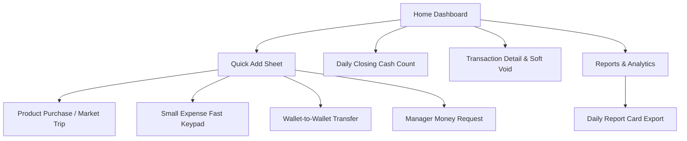
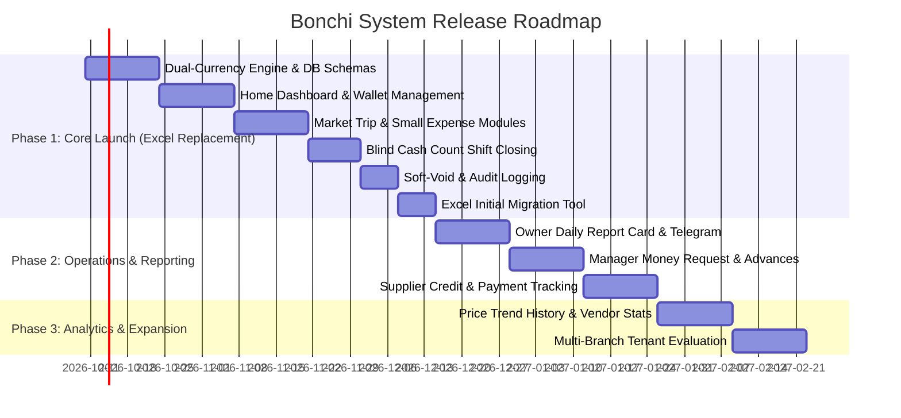

# Product Requirements Document (PRD)
## Bonchi — Restaurant Income & Expense Management System (Dual Currency USD/KHR)

- **Product Name:** Bonchi Restaurant Money App (ប្រព័ន្ធគ្រប់គ្រងចំណូលចំណាយភោជនីយដ្ឋាន)
- **Version:** 1.0.0 (Production Release Target)
- **Document Author / Product Manager:** @Somnang Pho / Product & Engineering Team
- **Date:** October 5, 2026
- **Status:** Approved for Implementation
- **Prototype Reference:** [Bonchi — Restaurant Money App.html](file:///d:/Bonchi%20System/Bonchi%20%E2%80%94%20Restaurant%20Money%20App.html) (9 Fully Verified Screens)
- **Original Spec Reference:** [Restaurant Income & Expense Tracker — PRD.md](file:///d:/Bonchi%20System/docs/Restaurant%20Income%20&%20Expense%20Tracker%20%E2%80%94%20PRD.md)

---

## 1. Executive Summary & Vision

### 1.1 Vision
Bonchi is a mobile-first, high-velocity financial management system specifically architected for Cambodian restaurants, cafes, and eateries operating in a dual-currency environment (USD & KHR). The application eliminates error-prone Excel spreadsheets by capturing every dollar and riel at the point of activity, tracking real-time wallet balances, securing daily cash closes through blind counts, and delivering instant executive export reports directly to restaurant owners.

### 1.2 Core Problem Statement
1. **Dual Currency Friction:** Cambodian food operations purchase goods mixing USD and KHR in single transactions (e.g. ice in KHR, meat in USD). Standard accounting tools force arbitrary conversion, causing exchange-rate losses and discrepancies.
2. **Scattered Money Locations:** Restaurant funds sit across multiple physical and digital locations (Cash Drawer, Petty Cash, Staff Advances, ABA/Bakong QR, Delivery Apps). Owners lack visibility into where liquidity actually resides.
3. **End-of-Day Cash Discrepancies:** Drawer shortages are identified days later, making it impossible to assign accountability or verify whether change errors or shrinkage occurred.
4. **Chaotic Multi-Shop Market Trips:** Staff purchase from 5 to 10 market vendors in a single morning run, receiving informal receipts or handwritten notes, causing delayed or missing entries.
5. **Untracked Cash Advances:** Managers take cash for staff tips, machine repairs, or emergency supplies with loose receipts and delayed settlement.

### 1.3 Key Product Goals & Success Metrics
- **100% Purchase Capture:** Retire Excel spreadsheets within 30 days of launch; 0 offline ledger reliance.
- **Daily Reconciliation Rate:** 100% of cash drawers and petty cash wallets reconciled daily at closing before 22:00.
- **Sub-1-Minute Market Trip Entry:** Complete entry of a 3-shop, 6-item market trip in under 60 seconds on a smartphone.
- **Sub-10-Second Small Expense Entry:** Log a quick daily expense (e.g., ice or gas) in under 10 seconds via custom numeric keypad.
- **Zero Currency Distortion:** Absolute mathematical separation of USD and KHR balances across the entire transactional lifecycle.

---

## 2. User Personas & Permissions Matrix (RBAC)

### 2.1 User Personas
1. **The Owner (ម្ចាស់ - e.g., Lok Bong):**
   - *Needs:* Real-time live dashboard of all wallets (Cash Drawer, Petty Cash, ABA, Delivery), daily profit/loss in dual currencies, debt owed to vendors, daily Telegram report cards, master approval authority for money requests, and void audits.
   - *Device:* Mobile phone & tablet (often checks while off-site).
2. **The Manager (អ្នកគ្រប់គ្រង - e.g., Sokha):**
   - *Needs:* Record shop purchases, request money for operational repairs and staff tip distributions, oversee staff daily cash count, rectify same-day transaction errors.
   - *Device:* Counter POS tablet / Mobile.
3. **Operational Staff (បុគ្គលិក - e.g., Srey Mom):**
   - *Needs:* Fast entry at local wet markets (Phsar Thmey, Phsar Deum Kor), quick logging of ice/gas/motodop expenses, denomination counting of physical banknotes at shift closing.
   - *Device:* Personal or restaurant Android/iOS smartphone in wet, fast-paced environments.

### 2.2 Permissions Matrix

| Feature / Action | Owner | Manager | Staff | Prototype & UI Behavior |
| :--- | :---: | :---: | :---: | :--- |
| **View Live Dashboard** | Full (All Wallets & Net Profit) | Operational (Petty Cash + Drawer) | Restricted (Personal Spending Only) | Dynamic Home layout toggles by `role` |
| **Create Invoices (Purchase & Small Expense)** | Yes | Yes | Yes | Available via Add Sheet (+) |
| **Edit / Void Invoices** | Full History | Own entries, same-day only | No (View only) | Soft-void modal with required reason |
| **Wallet-to-Wallet Transfers** | Yes | Yes (Operational) | No | Protected by role validation |
| **Conduct Shift Closing Count** | Yes | Yes | Yes | Blind Count stepper UI |
| **Create Money Request** | Yes | Yes | No | Generates advance settlement tracker |
| **Approve / Reject Money Request** | Yes | No | No | Transfers cash to Manager Advance |
| **Access Financial Reports** | All Periods & P&L | Today & Yesterday | None | Hidden from bottom navigation for Staff |
| **Generate Owner Export Card (PNG/Excel)** | Yes | Yes | No | Accessible from Reports tab |
| **Master Data (Suppliers, Products, Wallets, Users)** | Full CRUD | View Only | View Only | Settings screen (Owner only) |

---

## 3. Product Principles & Architecture Rules

1. **Dual Currency Strict Isolation (រូបិយប័ណ្ណដាច់ដោយឡែក):**
   - USD and KHR are treated as first-class, independent currencies.
   - USD is stored to 2 decimal places (`DECIMAL(12,2)`).
   - KHR is stored as whole integers (`DECIMAL(14,0)`).
   - The database NEVER stores a single unified currency. Combined totals on reports are purely illustrative (view-only) calculated dynamically using an owner-defined reference rate (e.g. 4,000 KHR / $1).
2. **Transfers are Non-Commercial Movements (មិនមែនចំណូល ឬចំណាយ):**
   - Transfers between restaurant wallets (e.g., Drawer to Petty Cash, or ABA to Drawer) NEVER trigger Income or Expense events and are strictly excluded from Profit & Loss calculations.
3. **Soft Deletions & Audit Integrity (មិនលុបជាស្ថាពរ):**
   - Financial transactions are never hard-deleted. Voiding requires a mandatory reason, cancels the wallet ledger effect, displays strikethrough/void banners, and appends an immutable entry to the Audit Log.
4. **Bilingual by Design (Khmer & English):**
   - Every label, button, and report header features native Khmer accompanied by contextual English subtitles (e.g. `ទិញទំនិញ · Product purchase`).

---

## 4. Feature-by-Feature Product Requirements

---

### Feature 1: Dual-Currency Core & Reference Valuation Engine
- **Objective:** Provide robust financial accuracy without exchange rate distortions.
- **User Story:** As an owner, I want my accounting to record exact amounts in USD and KHR without automatic conversion, so my ledger matches physical cash and bank slips.
- **Key Requirements:**
  - Segregated currency balances on all wallets: `Balance_USD` and `Balance_KHR`.
  - Transaction lines specify either `USD` or `KHR`. Mixed invoices store items in their native currency.
  - Multi-currency display format: `$47.00 + 55,000 ៛`.
  - Optional report reference conversion widget: calculates approximate total in KHR (e.g. `អត្រា 4,000 ៛ = $1 ≈ 6,353,200 ៛`) labeled explicitly: *"សម្រាប់មើលប៉ុណ្ណោះ · view only, not stored"*.
- **Acceptance Criteria:**
  - Totals are never summed together in database storage.
  - Cross-currency payment captures the actual rate applied at the moment of payment only.

---

### Feature 2: Multi-Role Adaptive Home Dashboard
*(Prototype: Screen 1 — `1 · ទំព័រដើម Home`)*
- **Objective:** Provide immediate financial pulse tailored to the logged-in user role.
- **Key Requirements:**
  - **Header:** Displays current date in Khmer (e.g., `ច័ន្ទ 5 តុលា 2026`), role indicator (`ម្ចាស់` or `បុគ្គលិក`), and search icon button.
  - **Closing Alert Banner:** Prominent status box (`មិនទាន់រាប់លុយថ្ងៃនេះ · បិទហាងម៉ោង 21:00`) with quick action button `រាប់ឥឡូវ` linking directly to Daily Count.
  - **Summary Cards (DualTotal):**
    - Owner view: Today's Income (`ចំណូលថ្ងៃនេះ`) and Today's Expense (`ចំណាយថ្ងៃនេះ`) in both currencies.
    - Staff view: Replaced with personal daily expenditure summary (`ខ្ញុំបានចាយថ្ងៃនេះ · My spending today`).
  - **Wallet Carousel:**
    - Owner: Horizontal scroll card deck of all wallets: Cash Drawer (`ថតលុយ`), Petty Cash (`លុយចាយប្រចាំថ្ងៃ`), Bank (`ABA`), Delivery Apps. Shows live USD and KHR balances.
    - Staff: Filtered to show only operational Petty Cash or Staff Advance wallets.
  - **Recent Transactions Ledger:**
    - Live feed showing category icon, transaction title, supplier/shop, timestamp, item count, payment wallet, and USD/KHR amounts.
  - **Role-Adaptive Bottom Navigation:**
    - Owner: `Home (ទំព័រដើម)` | `Wallets (កាបូប)` | `(+) Center Add Action` | `Reports (របាយការណ៍)` | `Me (ខ្ញុំ)`.
    - Staff: `Home (ទំព័រដើម)` | `Count (រាប់លុយ)` | `(+) Center Add Action` | `History (ប្រវត្តិ)` | `Me (ខ្ញុំ)`.
- **Acceptance Criteria:**
  - Staff never see bank balances or restaurant net profit figures.
  - Tapping transaction row navigates to Transaction Detail (`Detail.dc.html`).

---

### Feature 3: Action Sheet Dispatcher (Add Sheet)
*(Prototype: Screen 2 — `2 · + Add sheet`)*
- **Objective:** Enable one-tap access to all operational entries from anywhere in the app.
- **Key Requirements:**
  - Full-screen modal overlay with bottom drag-sheet container.
  - Title: `កត់ត្រាថ្មី · What do you want to record?` with close (x) button.
  - 2x2 Grid Tiles with high-contrast colored discs:
    1. **Product Purchase (`ទិញទំនិញ · Product purchase`):** Red cart icon, links to Market Trip.
    2. **Small Expense (`ចំណាយតូចតាច · Small expense`):** Red coins icon, links to Fast Keypad.
    3. **Income (`ចំណូល · Income`):** Green income arrow icon.
    4. **Transfer (`ផ្ទេរប្រាក់ · Transfer`):** Blue transfer arrows icon, links to Transfer screen.
  - Full-width Manager Action Tile:
    - **Request Money (`ស្នើសុំលុយ · Request money · អ្នកគ្រប់គ្រង`):** Gold money request icon with chevron.
  - Footer context info: Shows time and place of last logged transaction (`ចុងក្រោយ៖ ទិញនៅផ្សារថ្មី · 07:40`).

---

### Feature 4: Market Trip & Multi-Shop Batch Invoicing
*(Prototype: Screen 3 — `3 · ទិញទំនិញ Product purchase`)*
- **Objective:** Support rapid recording of morning market runs across multiple vendors in a single workflow.
- **User Story:** As staff purchasing chicken from Vendor A and rice from Vendor B, I want to add multiple shops into one market trip and have the system generate separate invoices automatically.
- **Key Requirements:**
  - **Trip Header:** Displays total shops (`ដើរផ្សារ · Market trip · 2 ហាង`) with automated separate invoice creation helper text.
  - **Shop Grouping Cards:**
    - Shows Shop Name, item count, subtotal per currency, and invoice attachment status (`មានវិក្កយបត្រ`).
    - Camera icon toggle: quick receipt photo capture per shop card.
    - Item lines inside shop card: Name, quantity × unit price, and line subtotal. Tapping an item opens the edit drawer.
  - **Add Shop Sheet (`ជ្រើសហាង · Choose a shop`):**
    - Search input: `ស្វែងរកហាង ឬ បង្កើតថ្មី` (Search shop or create new).
    - Top frequent shops list with visit counts: Meat shop (ផ្សារថ្មី), Rice shop (មីងស្រី), Vegetable shop (ផ្សារដើមគរ), Grocery shop (បងណារី).
    - Fallback option: Unknown Seller (`អ្នកលក់មិនស្គាល់ឈ្មោះ · Unknown seller · ផ្សារ ឬ រទេះតាមផ្លូវ`).
  - **Add Item Sheet (`ជ្រើសមុខទំនិញ`):**
    - Pre-loaded Catalog items with last-purchased price hints.
    - Fast search input (`ស្វែងរក · sach, chicken...`).
  - **Item Editor Sheet:**
    - Quantity stepper (`−` and `+`).
    - Currency selector buttons (`$ ដុល្លារ` vs `៛ រៀល`).
    - Unit price input (auto-sanitizes decimal for USD, integers for KHR).
    - Last price paid indicator: `ចុងក្រោយពីហាងនេះ៖ $3.50 · 2 តុលា`.
    - Live item subtotal calculation.
    - Delete item action button (`លុប`).
  - **Batch Settlement & Save:**
    - Payment wallet selector (`បង់ពី លុយចាយ · ទាំង 2 ហាង`).
    - Paid status toggle: Paid on spot (`paid`) vs Unpaid / Credit (`unpaid`).
    - Primary CTA: `រក្សាទុក 2 វិក្កយបត្រ` (Save 2 invoices).

---

### Feature 5: Quick Small Expense with Custom Numeric Keypad
*(Prototype: Screen 4 — `4 · ចំណាយតូចតាច Small expense`)*
- **Objective:** Log recurring minor operational costs (ice, gas refills, soap, moto fares) in under 10 seconds.
- **Key Requirements:**
  - **Currency Toggle:** Sticky segmented control (`$ ដុល្លារ` / `៛ រៀល`).
  - **Large Amount Display:** Prominent center numeral with dynamic currency symbol ($ prefix or ៛ suffix).
  - **Quick Increment Chips:**
    - KHR: `+1,000` | `+5,000` | `+10,000` | `+50,000`.
    - USD: `+$1` | `+$5` | `+$10` | `+$20`.
  - **Category Quick Chips:**
    - Horizontal wrapping chips: Ice (`ទឹកកក`), Gas (`ហ្គាស`), Tissues (`ក្រដាសអនាម័យ`), Soap (`សាប៊ូ`), Motodop (`ម៉ូតូឌុប`), Charcoal (`ធ្យូង`), Other (`ផ្សេងៗ`).
  - **Dedicated Mobile Keypad:**
    - Keys: `1` to `9`, `0`, Backspace `⌫`.
    - KHR mode key: `000` for rapid thousand entries.
    - USD mode key: `.` for decimal amounts (max 2 decimals).
  - **Default Wallet & Save:** Defaults to Petty Cash (`លុយចាយប្រចាំថ្ងៃ`). Save button disabled until amount > 0 and category selected.

---

### Feature 6: Internal Wallet-to-Wallet Transfers
*(Prototype: Screen 5 — `5 · ផ្ទេរប្រាក់ Transfer`)*
- **Objective:** Move money between restaurant wallets without distorting financial P&L statements.
- **Key Requirements:**
  - Header explicitly states: `ផ្ទេរប្រាក់ · Transfer · មិនមែនចំណូល ឬចំណាយ` (Not income or expense).
  - **Source Wallet Selection (`ពី From`):** Chips showing live balance (e.g. `មាន $186.00`).
  - **Destination Wallet Selection (`ទៅ To`):** Mutually exclusive chips (source cannot be destination).
  - **Swap Button (⇄):** Inverts From and To with one tap.
  - **Amount & Currency:** Segmented currency control + numeric input with live CurrencyChip.
  - **Over-Balance Protection:** If transfer amount exceeds source balance in that currency, triggers red alert banner (`លើសពីលុយដែលមានក្នុង ថតលុយ`) and disables transfer button.
  - **Confirmation Banner:** Displays formatted preview (`ផ្ទេរ $100.00 ពី ថតលុយ ទៅ លុយចាយប្រចាំថ្ងៃ`).

---

### Feature 7: End-of-Day Blind Cash Count & Reconciliation
*(Prototype: Screen 6 — `6 · រាប់លុយបិទហាង Daily count`)*
- **Objective:** Prevent cash skimming and eliminate closing discrepancies via structured denomination counting.
- **Key Requirements:**
  - Multi-wallet selector (e.g. Cash drawer wallet 1 of 2).
  - Currency tabs with running completion totals: `៛ រៀល · 420,000 ៛` and `$ ដុល្លារ · $186.00`.
  - **Physical Banknote Steppers:**
    - KHR Denominations: 100,000 ៛ | 50,000 ៛ | 20,000 ៛ | 10,000 ៛ | 5,000 ៛ | 1,000 ៛ | 500 ៛.
    - USD Denominations: $100 | $50 | $20 | $10 | $5 | $1.
    - Each row contains colored banknote badge, `−` and `+` steppers, note count, and row total.
  - **Blind Count Workflow:**
    - System balance is concealed from counter until counting is finished.
    - Counter taps `ពិនិត្យជាមួយប្រព័ន្ធ` (Check with system) to reveal comparison.
  - **Discrepancy Analysis & Threshold Enforcement:**
    - Shows Counted Amount, System Balance, and Discrepancy.
    - Tolerance thresholds: KHR: ±10,000 ៛ | USD: ±$2.00.
    - If discrepancy exceeds tolerance, a mandatory Reason field appears (`មូលហេតុ · ត្រូវការ · ម្ចាស់នឹងទទួលដំណឹង` - Required, Owner will be notified!).
  - **Submit Count:** Button `បញ្ជាក់ការរាប់` records the audit snapshot with timestamp and user ID.

---

### Feature 8: Transaction Ledger, Details & Soft-Void Engine
*(Prototype: Screen 7 — `7 · ព័ត៌មានលម្អិត Transaction detail`)*
- **Objective:** Full audit visibility and safe rectification of mistyped records.
- **Key Requirements:**
  - Invoice header: Invoice number (e.g., `#0412`), status badge (`បានបង់ Paid`, `មិនទាន់បង់ Unpaid`, `បានលុបចោល Void`).
  - Breakdown: Vendor name, timestamp, item lines with quantities and individual line amounts.
  - Payment attributes: Wallet used, USD paid, KHR paid, category.
  - Receipt preview thumbnail.
  - Audit trail line: Creator name, role, timestamp (e.g. `បង្កើតដោយ ស្រីមុំ (បុគ្គលិក) · 07:40`).
  - **Soft-Void Sheet:**
    - Manager or Owner taps `លុបចោល` (Void).
    - Modal explains: `Void · មិនលុបជាស្ថាពរ — នៅតែឃើញក្នុងប្រវត្តិ` (Soft delete, remains in history).
    - Mandatory reason selection chips: Mistyped (`បញ្ចូលខុស`), Duplicate (`កត់ស្ទួន`), Vendor Cancelled (`អ្នកផ្គត់ផ្គង់ដកវិញ`), Other (`ផ្សេងៗ`).
    - Upon confirmation: transaction is tagged as void, amounts are strikethrough, removed from all revenue/expense summaries, and audit trail updates immediately (`លុបចោលដោយ សុខា (អ្នកគ្រប់គ្រង) · ឥឡូវនេះ`).

---

### Feature 9: Management Reports & Multi-Period Analytics
*(Prototype: Screen 8 — `8 · របាយការណ៍ Reports`)*
- **Objective:** Give owners comprehensive visibility into profitability and cash flow across time horizons.
- **Key Requirements:**
  - **Time Period Filter Chips:** Today (`ថ្ងៃនេះ`), Yesterday (`ម្សិលមិញ`), This Week (`សប្តាហ៍នេះ`), This Month (`ខែនេះ`).
  - **DualTotal Summary:** Total spend in both USD and KHR for selected period.
  - **Accounts Payable Alert Card (`ត្រូវបង់បន្ថែម · Still to pay`):**
    - High-visibility amber card displaying unpaid amounts in USD and KHR with vendor breakdown notes (e.g., `ជំពាក់ 2 ហាង៖ ហាងទឹកកក សុខលី · ហាងភេសជ្ជៈ ដារ៉ា`).
  - **Settlement Method Card:** Paid total, QR payments, and Cash payments.
  - **Export Launcher:** Direct navigation to full landscape report card export (`មើលរូបភាពរបាយការណ៍`).

---

### Feature 10: Owner Daily Report Card & Multi-Channel Export
*(Prototype: Screen 9 — `9 · រូបភាពរបាយការណ៍ Export for owner`)*
- **Objective:** Generate a standardized, beautiful, shareable financial snapshot ready for Telegram or printing.
- **Key Requirements:**
  - Standardized landscape document container (1123px × 794px, A4 ratio).
  - Header: Restaurant Name, `របាយការណ៍ចំណាយប្រចាំថ្ងៃ` (Daily Expense Report), formatted date, preparer name and time, item count, vendor count, unpaid count.
  - **4-Card Top Metric Strip:**
    1. Total Spend (`ចំណាយសរុប`): USD + KHR.
    2. Paid (`បានទូទាត់`): USD + KHR in success green.
    3. Still to Pay (`ត្រូវបង់បន្ថែម`): USD + KHR in warning gold.
    4. Paid By (`បង់តាម`): QR and Cash breakdowns.
  - **Full Itemized Ledger Table:** Columns for `#`, Item, Shop, Qty, Unit Price, Payment Method Pill (`QR`, `Cash`, `! ជំពាក់`), USD Total, KHR Total.
  - **Currency Summary Matrix:** Table comparing Unpaid vs Paid vs Total across USD and KHR.
  - **Accounts Payable Ledger (`នៅជំពាក់ហាង · Owed to shops`):** Itemizes exact debt per vendor.
  - **View-Only Valuation Conversion:** Reference calculation at current market rate with clear disclaimer.
  - **Signature Blocks:** Formal sign-off lines for Preparer (`អ្នករៀបចំ`) and Owner (`ម្ចាស់ · Owner`).
  - **Export Actions:** One-tap Send to Telegram (`ផ្ញើរូបភាព · Telegram`), Save PNG (`រក្សាទុក PNG`), and Download Excel (`ទាញយក Excel`).

---

### Feature 11: Manager Cash Advances & Money Requests
- **Objective:** Manage cash handoffs for staff tips, repairs, and emergency supplies with complete distribution tracking.
- **Key Requirements:**
  - Manager submits request: Amount, Currency, Category, Purpose/Reason.
  - Owner receives high-priority notification with Approve/Reject actions.
  - On approval: funds move from Cash Drawer/Petty Cash into `Manager Advance` wallet.
  - Manager logs itemized distributions: Staff name, amount, date, and receipt note.
  - Leftover cash is returned via transfer back to Petty Cash. Request settles automatically when advance wallet balance returns to zero.

---

## 5. Non-Functional Requirements (NFR)

1. **Performance & Responsiveness:**
   - Cold boot to dashboard under 1.5 seconds on 4G mobile.
   - Screen transitions and drawer animations execute at steady 60 fps.
   - Offline-first form caching: draft inputs remain intact if app is closed or connection drops.
2. **Data Integrity & Consistency:**
   - ACID-compliant transactions on all wallet balance mutations.
   - Idempotent API endpoints for invoice creation and payment processing.
   - Automated daily database snapshot backups with point-in-time recovery.
3. **Security & Auditability:**
   - Role-based authorization enforced on every API route.
   - JWT session management with device binding.
   - Receipt images compressed client-side before secure upload to S3-compatible cloud storage.
   - Append-only audit log table.

---

## 6. Implementation Phasing & Roadmap

- **Phase 1 Gate:** 100% of wet market trips, petty cash expenses, and daily cash counts recorded in Bonchi; Excel fully deprecated.
- **Phase 2 Gate:** Manager advances fully settled in app; automated daily Telegram report card received by owner daily.
