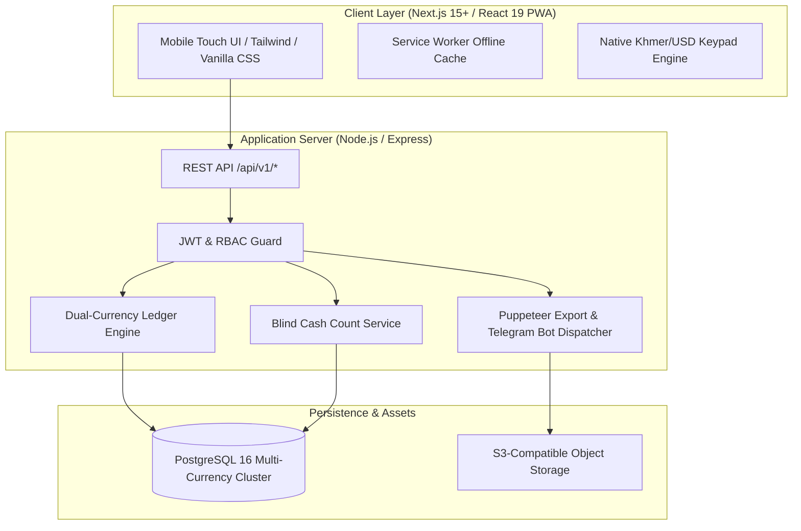

# FRD — System Overview, Architecture & Master Data Schema
## Document Ref: `BONCHI-FRD-00`

- **System:** Bonchi Restaurant Money App (ប្រព័ន្ធគ្រប់គ្រងចំណូលចំណាយភោជនីយដ្ឋាន)
- **Module:** System Architecture, Technical Foundations & Database Schema
- **Target Tech Stack:** Next.js (React 19, PWA) + Node.js/Express (API) + PostgreSQL 16 (DB) + S3 (Receipts)
- **Companion PRD:** [Bonchi_Restaurant_Money_App_PRD.md](file:///d:/Bonchi%20System/docs/Bonchi_Restaurant_Money_App_PRD.md)
- **Prototype Reference:** [Bonchi — Restaurant Money App.html](file:///d:/Bonchi%20System/Bonchi%20%E2%80%94%20Restaurant%20Money%20App.html)

---

## 1. Technical Architecture Overview

Bonchi RMS is designed for high-concurrency, offline-resilient restaurant operations in Cambodia.



### 1.1 Non-Negotiable Core Rules
1. **Currency Segregation:** No transaction or wallet balance combines USD and KHR in database storage.
2. **Numeric Precision:**
   - USD: `DECIMAL(12,2)`
   - KHR: `DECIMAL(14,0)` (Whole integers)
3. **No Hard Deletes:** Financial rows are soft-voided with immutable audit records.
4. **Offline Resilience:** Input forms persist in browser `IndexedDB` until network availability is verified.

---

## 2. Complete Relational Database Schema (DDL)

```sql
-- Enums
CREATE TYPE user_role AS ENUM ('owner', 'manager', 'staff');
CREATE TYPE category_type AS ENUM ('income', 'expense');
CREATE TYPE wallet_type AS ENUM ('cash_drawer', 'petty_cash', 'bank', 'delivery_app', 'staff_advance', 'manager_advance', 'tips');
CREATE TYPE invoice_type AS ENUM ('expense', 'income');
CREATE TYPE expense_kind AS ENUM ('product', 'small');
CREATE TYPE invoice_status AS ENUM ('paid', 'partial', 'unpaid', 'void');
CREATE TYPE payment_method AS ENUM ('cash', 'qr', 'bank_transfer', 'credit');
CREATE TYPE request_status AS ENUM ('pending', 'approved', 'rejected', 'settled');

-- 1. Users
CREATE TABLE users (
    id BIGINT GENERATED BY DEFAULT AS IDENTITY PRIMARY KEY,
    username VARCHAR(100) UNIQUE NOT NULL,
    name VARCHAR(100) NOT NULL,
    phone VARCHAR(20),
    password_hash VARCHAR(255) NOT NULL,
    role user_role NOT NULL DEFAULT 'staff',
    is_active BOOLEAN NOT NULL DEFAULT true,
    created_at TIMESTAMPTZ NOT NULL DEFAULT NOW(),
    updated_at TIMESTAMPTZ NOT NULL DEFAULT NOW()
);

-- 2. Categories
CREATE TABLE categories (
    id BIGINT GENERATED BY DEFAULT AS IDENTITY PRIMARY KEY,
    name_km VARCHAR(100) NOT NULL,
    name_en VARCHAR(100),
    type category_type NOT NULL,
    parent_id BIGINT REFERENCES categories(id) ON DELETE SET NULL,
    icon VARCHAR(50),
    is_active BOOLEAN NOT NULL DEFAULT true
);

-- 3. Suppliers
CREATE TABLE suppliers (
    id BIGINT GENERATED BY DEFAULT AS IDENTITY PRIMARY KEY,
    name VARCHAR(150) NOT NULL,
    market_location VARCHAR(100),
    contact_phone VARCHAR(50),
    note TEXT,
    is_active BOOLEAN NOT NULL DEFAULT true,
    created_at TIMESTAMPTZ NOT NULL DEFAULT NOW()
);

-- 4. Products
CREATE TABLE products (
    id BIGINT GENERATED BY DEFAULT AS IDENTITY PRIMARY KEY,
    name VARCHAR(150) NOT NULL,
    default_unit VARCHAR(50) NOT NULL,
    category_id BIGINT REFERENCES categories(id) ON DELETE RESTRICT,
    default_currency VARCHAR(3) CHECK (default_currency IN ('USD', 'KHR')),
    default_unit_price DECIMAL(14,2) DEFAULT 0,
    is_active BOOLEAN NOT NULL DEFAULT true
);

-- 5. Wallets
CREATE TABLE wallets (
    id BIGINT GENERATED BY DEFAULT AS IDENTITY PRIMARY KEY,
    code VARCHAR(50) UNIQUE NOT NULL,
    name_km VARCHAR(100) NOT NULL,
    name_en VARCHAR(100) NOT NULL,
    type wallet_type NOT NULL,
    opening_usd DECIMAL(12,2) NOT NULL DEFAULT 0.00,
    opening_khr DECIMAL(14,0) NOT NULL DEFAULT 0,
    current_usd DECIMAL(12,2) NOT NULL DEFAULT 0.00,
    current_khr DECIMAL(14,0) NOT NULL DEFAULT 0,
    is_active BOOLEAN NOT NULL DEFAULT true,
    created_at TIMESTAMPTZ NOT NULL DEFAULT NOW()
);

-- 6. Invoices
CREATE TABLE invoices (
    id BIGINT GENERATED BY DEFAULT AS IDENTITY PRIMARY KEY,
    invoice_no VARCHAR(50) UNIQUE NOT NULL,
    invoice_date DATE NOT NULL DEFAULT CURRENT_DATE,
    invoice_time TIME NOT NULL DEFAULT CURRENT_TIME,
    type invoice_type NOT NULL DEFAULT 'expense',
    expense_kind expense_kind,
    market_trip_id BIGINT,
    supplier_id BIGINT REFERENCES suppliers(id) ON DELETE RESTRICT,
    category_id BIGINT REFERENCES categories(id) ON DELETE RESTRICT,
    total_usd DECIMAL(12,2) NOT NULL DEFAULT 0.00,
    total_khr DECIMAL(14,0) NOT NULL DEFAULT 0,
    status invoice_status NOT NULL DEFAULT 'paid',
    void_reason VARCHAR(100),
    voided_by BIGINT REFERENCES users(id),
    voided_at TIMESTAMPTZ,
    receipt_url TEXT,
    note TEXT,
    created_by BIGINT NOT NULL REFERENCES users(id),
    created_at TIMESTAMPTZ NOT NULL DEFAULT NOW(),
    updated_at TIMESTAMPTZ NOT NULL DEFAULT NOW()
);

-- 7. Invoice Items
CREATE TABLE invoice_items (
    id BIGINT GENERATED BY DEFAULT AS IDENTITY PRIMARY KEY,
    invoice_id BIGINT NOT NULL REFERENCES invoices(id) ON DELETE CASCADE,
    product_id BIGINT REFERENCES products(id) ON DELETE RESTRICT,
    item_name VARCHAR(150) NOT NULL,
    quantity DECIMAL(10,3) NOT NULL CHECK (quantity > 0),
    unit VARCHAR(50) NOT NULL,
    unit_price DECIMAL(14,2) NOT NULL CHECK (unit_price >= 0),
    currency VARCHAR(3) NOT NULL CHECK (currency IN ('USD', 'KHR')),
    line_total DECIMAL(14,2) NOT NULL CHECK (line_total >= 0),
    created_at TIMESTAMPTZ NOT NULL DEFAULT NOW()
);

-- 8. Invoice Payments
CREATE TABLE invoice_payments (
    id BIGINT GENERATED BY DEFAULT AS IDENTITY PRIMARY KEY,
    invoice_id BIGINT NOT NULL REFERENCES invoices(id) ON DELETE CASCADE,
    wallet_id BIGINT NOT NULL REFERENCES wallets(id) ON DELETE RESTRICT,
    amount DECIMAL(14,2) NOT NULL CHECK (amount > 0),
    currency VARCHAR(3) NOT NULL CHECK (currency IN ('USD', 'KHR')),
    method payment_method NOT NULL DEFAULT 'cash',
    cross_currency_rate DECIMAL(10,4),
    paid_at TIMESTAMPTZ NOT NULL DEFAULT NOW(),
    created_by BIGINT NOT NULL REFERENCES users(id)
);

-- 9. Transfers
CREATE TABLE transfers (
    id BIGINT GENERATED BY DEFAULT AS IDENTITY PRIMARY KEY,
    transfer_date DATE NOT NULL DEFAULT CURRENT_DATE,
    from_wallet_id BIGINT NOT NULL REFERENCES wallets(id) ON DELETE RESTRICT,
    to_wallet_id BIGINT NOT NULL REFERENCES wallets(id) ON DELETE RESTRICT,
    amount DECIMAL(14,2) NOT NULL CHECK (amount > 0),
    currency VARCHAR(3) NOT NULL CHECK (currency IN ('USD', 'KHR')),
    note TEXT,
    request_id BIGINT,
    created_by BIGINT NOT NULL REFERENCES users(id),
    created_at TIMESTAMPTZ NOT NULL DEFAULT NOW(),
    CONSTRAINT check_different_wallets CHECK (from_wallet_id <> to_wallet_id)
);

-- 10. Wallet Counts (Daily Blind Cash Count)
CREATE TABLE wallet_counts (
    id BIGINT GENERATED BY DEFAULT AS IDENTITY PRIMARY KEY,
    wallet_id BIGINT NOT NULL REFERENCES wallets(id) ON DELETE RESTRICT,
    currency VARCHAR(3) NOT NULL CHECK (currency IN ('USD', 'KHR')),
    count_date DATE NOT NULL DEFAULT CURRENT_DATE,
    system_amount DECIMAL(14,2) NOT NULL,
    counted_amount DECIMAL(14,2) NOT NULL,
    difference DECIMAL(14,2) GENERATED ALWAYS AS (counted_amount - system_amount) STORED,
    tolerance_threshold DECIMAL(14,2) NOT NULL,
    denominations_breakdown JSONB NOT NULL,
    reason_for_gap TEXT,
    is_blind_count BOOLEAN NOT NULL DEFAULT true,
    counted_by BIGINT NOT NULL REFERENCES users(id),
    verified_by BIGINT REFERENCES users(id),
    created_at TIMESTAMPTZ NOT NULL DEFAULT NOW()
);

-- 11. Money Requests (Advances)
CREATE TABLE money_requests (
    id BIGINT GENERATED BY DEFAULT AS IDENTITY PRIMARY KEY,
    requested_by BIGINT NOT NULL REFERENCES users(id),
    amount DECIMAL(14,2) NOT NULL CHECK (amount > 0),
    currency VARCHAR(3) NOT NULL CHECK (currency IN ('USD', 'KHR')),
    category_id BIGINT REFERENCES categories(id) ON DELETE RESTRICT,
    reason TEXT NOT NULL,
    status request_status NOT NULL DEFAULT 'pending',
    approved_by BIGINT REFERENCES users(id),
    approved_at TIMESTAMPTZ,
    rejection_reason TEXT,
    created_at TIMESTAMPTZ NOT NULL DEFAULT NOW()
);

-- 12. Request Distributions
CREATE TABLE request_distributions (
    id BIGINT GENERATED BY DEFAULT AS IDENTITY PRIMARY KEY,
    request_id BIGINT NOT NULL REFERENCES money_requests(id) ON DELETE CASCADE,
    recipient_name VARCHAR(100) NOT NULL,
    amount DECIMAL(14,2) NOT NULL CHECK (amount > 0),
    currency VARCHAR(3) NOT NULL CHECK (currency IN ('USD', 'KHR')),
    given_at TIMESTAMPTZ NOT NULL DEFAULT NOW(),
    note TEXT
);

-- 13. Audit Log
CREATE TABLE audit_log (
    id BIGINT GENERATED BY DEFAULT AS IDENTITY PRIMARY KEY,
    table_name VARCHAR(50) NOT NULL,
    record_id BIGINT NOT NULL,
    action VARCHAR(20) NOT NULL,
    old_value JSONB,
    new_value JSONB,
    user_id BIGINT NOT NULL REFERENCES users(id),
    created_at TIMESTAMPTZ NOT NULL DEFAULT NOW()
);
```
