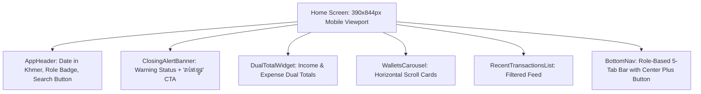

# FRD — Home Dashboard & Live Wallet Balances
## Document Ref: `BONCHI-FRD-02`

- **System:** Bonchi Restaurant Money App
- **Module:** Home Dashboard & Real-Time Wallet Balances
- **Prototype Screen:** Screen 1 — `1 · ទំព័រដើម Home` (`1_Home_unbundled.html`)
- **Companion PRD:** [Bonchi_Restaurant_Money_App_PRD.md](file:///d:/Bonchi%20System/docs/Bonchi_Restaurant_Money_App_PRD.md#feature-2-multi-role-adaptive-home-dashboard)

---

## 1. Feature Overview & Objectives
The Home Dashboard serves as the central operational cockpit. It immediately presents current liquidity, alerts users to mandatory closing cash counts, summarizes daily financial velocity, and routes staff and managers to their primary actions.

---

## 2. UI/UX Wireframe & Component Hierarchy



### 2.1 Component Specifications

#### A. `AppHeader`
- Title: `ថ្ងៃនេះ` (Today).
- Subtitle: Formatted date e.g. `ច័ន្ទ 5 តុលា 2026 · {roleLabel}` (e.g. `ម្ចាស់` or `បុគ្គលិក`).
- Actions: Search icon button (`aria-label="ស្វែងរក Search"`).

#### B. `ClosingAlertBanner` (`.bc-banner-warning`)
- Trigger: Active if cash drawer or petty cash count has not been recorded for the current calendar date.
- Message: `មិនទាន់រាប់លុយថ្ងៃនេះ · បិទហាងម៉ោង 21:00` (Cash not counted yet today · Store closing at 21:00).
- Action Button: `រាប់ឥឡូវ` (Count Now) navigating to `DailyCount.dc.html`.

#### C. `DualTotalWidget` & `CashVsBankLiquidityWidget`
- **Cash vs. Bank Liquidity Widget (Owner & Manager View):**
  - **💵 សាច់ប្រាក់ក្នុងដៃ (Cash in Hand):** Real-time aggregation of physical cash wallets (`drawer` + `petty`) in USD ($) and KHR (៛).
  - **🏦 ធនាគារ & KHQR (Bank & Digital):** Real-time aggregation of digital bank accounts (`aba` + `bakong`) in USD ($) and KHR (៛).
  - Live status indicator: `ផ្សាយផ្ទាល់ Live`.
- **Owner Daily Velocity:**
  - Income Card (`Bonchi.DualTotal`, `kind="income"`): Title `ចំណូលថ្ងៃនេះ · Income`, displays USD `$412.50` and KHR `1,280,000 ៛`.
  - Expense Card (`Bonchi.DualTotal`, `kind="expense"`): Title `ចំណាយថ្ងៃនេះ · Expense`, displays USD `$96.00` and KHR `185,000 ៛`.
- **Staff Mode:**
  - Single card: Title `ខ្ញុំបានចាយថ្ងៃនេះ · My spending today`, displays staff's logged spending for current day.

#### D. `WalletsCarousel` & Category Filter
- Section Title: `កាបូប` (Wallets).
- Category Filter Chips (Owner & Manager):
  - `ទាំងអស់` (All)
  - `💵 សាច់ប្រាក់` (Cash: Cash Drawer, Petty Cash)
  - `🏦 ធនាគារ` (Bank: ABA, Bakong KHQR)
- Horizontal scroll deck (`gap: 12px`, padding `16px`).
- Wallets:
  1. Cash Drawer (`ថតលុយ` - Category: `cash`): USD `$186.00`, KHR `420,000 ៛` (Owner only).
  2. Petty Cash (`លុយចាយប្រចាំថ្ងៃ` - Category: `cash`): USD `$40.00`, KHR `95,000 ៛` (All roles).
  3. ABA Bank (`ABA` - Category: `bank`): USD `$1,240.55`, KHR `2,450,000 ៛` (Owner & Manager).
  4. Bakong KHQR (`បាគង` - Category: `bank`): USD `$350.00`, KHR `850,000 ៛` (Owner & Manager).
  5. Manager Advance (`លុយអ្នកគ្រប់គ្រង` - Category: `advance`): USD `$0.00`, KHR `0 ៛` (Owner & Manager).

#### E. `RecentTransactionsList`
- Section Title: `ប្រតិបត្តិការថ្មីៗ` (Recent Transactions).
- Rows (`Bonchi.TransactionRow`):
  - Row 1: Expense `ទិញនៅផ្សារថ្មី` (3 items · Petty Cash · 07:40 · USD $47.00 + KHR 55,000 ៛).
  - Row 2: Small Expense `ទឹកកក` (Petty Cash · 09:15 · KHR 8,000 ៛).
  - Row 3: Income `ចំណូលពី Grab` (Delivery · ABA · 13:10 · USD $63.20) [Owner only].
  - Row 4: Transfer `ថតលុយ → លុយចាយ` (Transfer · 15:00 · USD $100.00) [Owner only].

#### F. `BottomNavigation` (5-Slot Fixed Dock)
- **Owner Bar:**
  1. `ទំព័រដើម` (Home) [Active]
  2. `កាបូប` (Wallets)
  3. `(+)` Floating Center Action Button (Links to `AddSheet.dc.html`)
  4. `របាយការណ៍` (Reports)
  5. `ខ្ញុំ` (Me/Profile)
- **Staff Bar:**
  1. `ទំព័រដើម` (Home) [Active]
  2. `រាប់លុយ` (Daily Count)
  3. `(+)` Floating Center Action Button (Links to `AddSheet.dc.html`)
  4. `ប្រវត្តិ` (History)
  5. `ខ្ញុំ` (Me/Profile)

---

## 3. Mathematical Balance Engine & Ledger Logic

The live balance of any wallet $W$ for currency $C \in \{\text{USD}, \text{KHR}\}$ is computed as:
$$\text{Balance}(W, C) = \text{Opening}(W, C) + \sum \text{Inflow}(W, C) - \sum \text{Outflow}(W, C)$$

Where:
- $\text{Inflow} = \text{CustomerPayments}(W, C) + \text{TransfersIn}(W, C)$
- $\text{Outflow} = \text{SupplierPayments}(W, C) + \text{TransfersOut}(W, C)$
- Voided invoices (`status = 'void'`) are mathematically excluded.

---

## 4. API Endpoints & Data Contracts

### `GET /api/v1/dashboard/summary`
- **Access:** Authenticated Users
- **Response `200 OK` (Owner Role):**
```json
{
  "date": "2026-10-05",
  "closing_count_completed": false,
  "closing_time": "21:00",
  "income_today": { "usd": 412.50, "khr": 1280000 },
  "expense_today": { "usd": 96.00, "khr": 185000 },
  "wallets": [
    { "id": "w-drawer", "name": "ថតលុយ", "usd": 186.00, "khr": 420000, "type": "cash_drawer" },
    { "id": "w-petty", "name": "លុយចាយប្រចាំថ្ងៃ", "usd": 40.00, "khr": 95000, "type": "petty_cash" },
    { "id": "w-aba", "name": "ABA", "usd": 1240.55, "khr": 0, "type": "bank" }
  ],
  "recent_transactions": [
    {
      "id": "inv-0412",
      "type": "expense",
      "title": "ទិញនៅផ្សារថ្មី",
      "subtitle": "3 មុខ · លុយចាយ · 07:40",
      "usd": 47.00,
      "khr": 55000
    }
  ]
}
```
