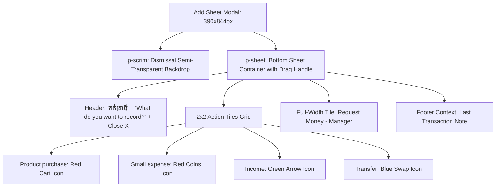

# FRD — Action Sheet Dispatcher Modal
## Document Ref: `BONCHI-FRD-03`

- **System:** Bonchi Restaurant Money App
- **Module:** Quick Transaction Dispatcher
- **Prototype Screen:** Screen 2 — `2 · + Add sheet` (`2_Add_sheet_unbundled.html`)
- **Companion PRD:** [Bonchi_Restaurant_Money_App_PRD.md](file:///d:/Bonchi%20System/docs/Bonchi_Restaurant_Money_App_PRD.md#feature-3-action-sheet-dispatcher-add-sheet)

---

## 1. Feature Overview & Objectives
The Action Sheet is a bottom-sheet modal dialog triggered by tapping the central `(+)` button from any screen. It allows staff and managers to quickly initiate any commercial or internal money movement with minimal thumb travel.

---

## 2. UI/UX Wireframe & Layout Specifications

### 2.1 Action Tiles Specification

| Tile Element | Icon | Disc Tone | Khmer Title | English Subtitle | Destination Target | Roles Permitted |
| :--- | :--- | :--- | :--- | :--- | :--- | :--- |
| **Tile 1** | `cart` | Red (`expense`) | ទិញទំនិញ | Product purchase | `Purchase.dc.html` | Owner, Manager, Staff |
| **Tile 2** | `coins` | Red (`expense`) | ចំណាយតូចតាច | Small expense | `SmallExpense.dc.html` | Owner, Manager, Staff |
| **Tile 3** | `income` | Green (`income`) | ចំណូល | Income | `IncomeForm.dc.html` | Owner, Manager |
| **Tile 4** | `transfer`| Blue (`transfer`) | ផ្ទេរប្រាក់ | Transfer | `Transfer.dc.html` | Owner, Manager |
| **Full Row Tile** | `request` | Gold (`gold`) | ស្នើសុំលុយ | Request money · អ្នកគ្រប់គ្រង | `MoneyRequestForm.dc.html` | Manager |

### 2.2 Payment Source Selector (Cash vs. Bank QR)
- A quick source selector is provided above the action tiles:
  - `💵 សាច់ប្រាក់ Cash`: Routes transactions by default to Petty Cash (`petty`) or Cash Drawer (`drawer`).
  - `🏦 ធនាគារ Bank QR`: Routes transactions to ABA Bank or Bakong KHQR.

### 2.3 Modal Dismissal & Backdrop Behavior
- Tapping anywhere on the `.p-scrim` backdrop immediately closes the sheet and returns the user to the underlying view.
- Tapping the `.bc-iconbtn` close (`x`) icon button closes the sheet.
- Swiping down on the `.p-grab` handle triggers touch dismissal.

### 2.3 Contextual Footer
- The bottom of the sheet contains a live reference to the most recent transaction logged by the restaurant team:
  `ចុងក្រោយ៖ {recent_transaction.title} · {recent_transaction.time}` (e.g. `ចុងក្រោយ៖ ទិញនៅផ្សារថ្មី · 07:40`).
- This prevents accidental double entries by showing the cashier what was just recorded.
