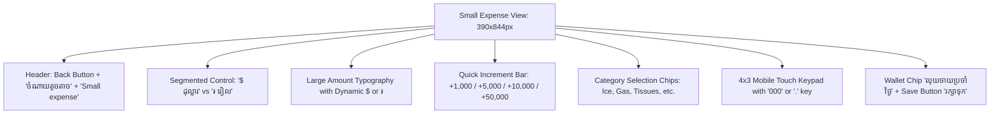

# FRD — Rapid Small Expense & Custom Virtual Keypad
## Document Ref: `BONCHI-FRD-05`

- **System:** Bonchi Restaurant Money App
- **Module:** Quick Daily Expenses & Specialized Mobile Keypad
- **Prototype Screen:** Screen 4 — `4 · ចំណាយតូចតាច Small expense` (`4_Small_expense_unbundled.html`)
- **Companion PRD:** [Bonchi_Restaurant_Money_App_PRD.md](file:///d:/Bonchi%20System/docs/Bonchi_Restaurant_Money_App_PRD.md#feature-5-quick-small-expense-with-custom-numeric-keypad)

---

## 1. Feature Overview & Objectives
Daily restaurant operations incur frequent, spontaneous cash outlays: ice deliveries, gas canister swaps, cleaning supplies, and motodop errands. Traditional dropdown-heavy accounting forms cause cashiers to delay or skip entries. This module delivers a purpose-built mobile interface with a custom on-screen virtual keypad that enables logging any small expense in under 10 seconds.

---

## 2. UI/UX Wireframe & Layout



---

## 3. Dedicated Virtual Keypad Engine Specification

```javascript
// Keypad button matrix mapping by currency
var labels = [
  '1', '2', '3',
  '4', '5', '6',
  '7', '8', '9',
  isKHR ? '000' : '.', '0', '⌫'
];
```

### 3.1 Input State Machine & Sanitization Rules
1. **Initial State:** `cur: 'KHR'`, `digits: '8000'`, `pick: 'ទឹកកក'`.
2. **Keypad Event Handlers:**
   - **Digit Keys (`0`–`9`):** Appends digit to string buffer.
   - **Triple Zero Key (`000` - KHR Only):**
     - If current digits is empty or `'0'`, sets to `'0'`.
     - Otherwise appends `'000'` (e.g. `5` $\to$ `5000`).
   - **Decimal Key (`.` - USD Only):**
     - If buffer already contains `.`, key press is ignored.
     - If buffer is empty, sets buffer to `'0.'`.
   - **Backspace Key (`⌫`):** Slices last character from string: `digits.slice(0, -1)`.
3. **Currency Switch Behavior:**
   - Switching from KHR to USD clears buffer to `''` and swaps `000` for `.`.
   - Switching from USD to KHR clears buffer to `''` and swaps `.` for `000`.
4. **Limits:** Maximum 9 numeric digits permitted.

---

## 4. Quick Increment & Category Chips

### 4.1 Quick Increments
- **KHR Increments:** `[1000, 5000, 10000, 50000]`.
  - Tapping `+10,000` adds 10,000 to active buffer.
- **USD Increments:** `[1, 5, 10, 20]`.
  - Tapping `+$5` adds 5.00 to active buffer.

### 4.2 Standard Category Chips
`['ទឹកកក', 'ហ្គាស', 'ក្រដាសអនាម័យ', 'សាប៊ូ', 'ម៉ូតូឌុប', 'ធ្យូង', 'ផ្សេងៗ']`
- **Translations:**
  - `ទឹកកក` = Ice
  - `ហ្គាស` = Cooking Gas refill
  - `ក្រដាសអនាម័យ` = Tissues / Napkins
  - `សាប៊ូ` = Dish soap / Cleaning detergent
  - `ម៉ូតូឌុប` = Motorbike taxi fare
  - `ធ្យូង` = Charcoal
  - `ផ្សេងៗ` = Other small expense

---

## 5. Settlement & API Contract

- **Default Wallet:** Petty cash (`លុយចាយប្រចាំថ្ងៃ`).
- **Validation:** Save button `រក្សាទុក` is disabled (`p-btn-off`) if `Number(digits) == 0` or no category is selected.

### `POST /api/v1/invoices/small-expense`
- **Access:** Owner, Manager, Staff
- **Request Body:**
```json
{
  "date": "2026-10-05",
  "amount": 8000,
  "currency": "KHR",
  "category_name": "ទឹកកក",
  "wallet_code": "petty",
  "note": null
}
```
- **Response `201 Created`:**
```json
{
  "success": true,
  "invoice_id": "8f9b2b24-0000-4000-8000-small00001",
  "invoice_no": "EXP-20261005-0915",
  "amount_formatted": "8,000 ៛",
  "wallet_balance_khr": 87000
}
```
