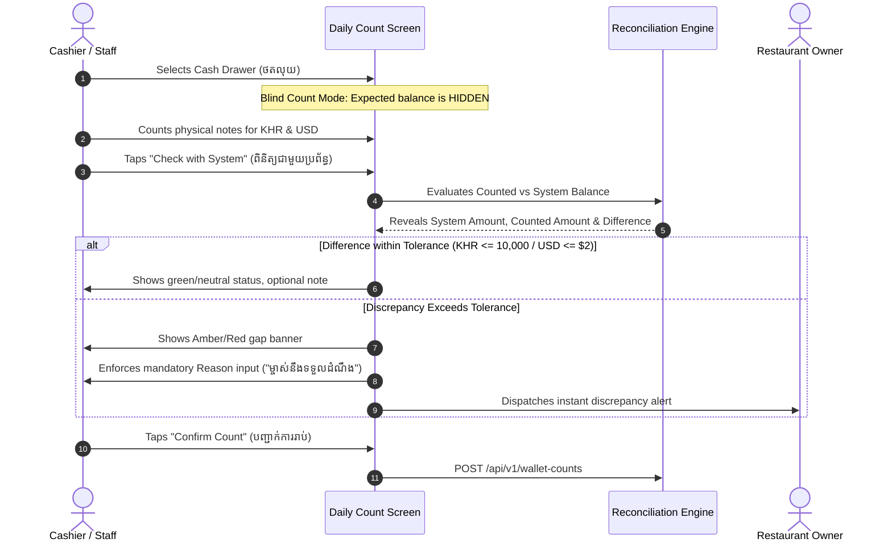

# FRD — End-of-Day Blind Cash Count & Reconciliation
## Document Ref: `BONCHI-FRD-07`

- **System:** Bonchi Restaurant Money App
- **Module:** Daily Cash Reconciliation & Blind Count Audit
- **Prototype Screen:** Screen 6 — `6 · រាប់លុយបិទហាង Daily count` (`6_Daily_count_unbundled.html`)
- **Companion PRD:** [Bonchi_Restaurant_Money_App_PRD.md](file:///d:/Bonchi%20System/docs/Bonchi_Restaurant_Money_App_PRD.md#feature-7-end-of-day-blind-cash-count--reconciliation)

---

## 1. Feature Overview & Objectives
To prevent cash shrinkage and verify drawer balances at shift close, staff conduct a physical denomination count. To ensure integrity, the system supports a **Blind Count Protocol** where expected system balances remain invisible until physical notes are counted and locked.

---

## 2. Denomination Counter Specifications

### 2.1 Supported Cambodian Banknote Denominations
```javascript
var DEN = {
  KHR: [100000, 50000, 20000, 10000, 5000, 1000, 500],
  USD: [100, 50, 20, 10, 5, 1]
};
```

### 2.2 Counter Stepper UX
Each denomination row displays:
1. Note badge (`.bc-note`): Color-coded note denomination (e.g. `50,000 ៛` or `$20`).
2. Stepper controls (`.bc-step`):
   - `−` button: decrements note count by 1 (minimum 0).
   - Count numeral: displays number of bills counted.
   - `+` button: increments note count by 1.
3. Row subtotal (`.bc-denom-sum`): displays $\text{Denomination} \times \text{Count}$ in real time.

---

## 3. Blind Count & Reconciliation Workflow



### 3.1 Tolerance Thresholds
- **KHR Tolerance:** `TOL.KHR = 10000` (10,000 ៛, ~ $2.50).
- **USD Tolerance:** `TOL.USD = 2` ($2.00).
- If $|\text{Counted} - \text{System}| > \text{Tolerance}$, input `reason_for_gap` is strictly required before submission.

---

## 4. API Specification

### `POST /api/v1/wallet-counts`
- **Access:** Owner, Manager, Staff
- **Request Body:**
```json
{
  "wallet_id": "8f9b2b24-4f27-4c1d-9321-729481928001",
  "currency": "KHR",
  "denominations": {
    "100000": 2,
    "50000": 3,
    "20000": 2,
    "10000": 2,
    "5000": 1
  },
  "reason_for_gap": "អាប់លុយខុសម្នាក់ (Short 5,000 Riel due to customer change error)"
}
```
- **Response `200 OK`:**
```json
{
  "count_id": "cnt-20261005-drawer-khr",
  "system_amount": 420000,
  "counted_amount": 415000,
  "difference": -5000,
  "within_tolerance": true,
  "recorded_by": "u-sreymom-staff",
  "timestamp": "2026-10-05T21:05:00+07:00"
}
```
