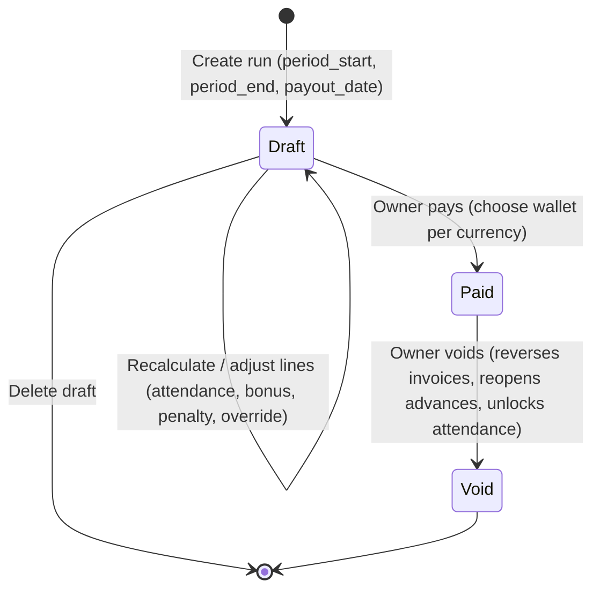

# FRD — Staff Salary & Payroll Management (By Count Day & Set Date)
## Document Ref: `BONCHI-FRD-13` · Version 2

- **System:** Bonchi Restaurant Money App
- **Module:** Staff Salary, Attendance Work-Day Counting, and Payroll Cycle by Set Date
- **Primary Actors:** Owner (rates, approval & payout), Manager (attendance, salary advances, draft preparation), Staff (payee — no login required)
- **Companion PRD:** [Bonchi_Restaurant_Money_App_PRD.md](file:///d:/Bonchi%20System/docs/Bonchi_Restaurant_Money_App_PRD.md)
- **Architecture Ref:** [00_FRD_System_Overview_and_Architecture.md](file:///d:/Bonchi%20System/docs/FRD/00_FRD_System_Overview_and_Architecture.md)
- **Depends on:** [01 Dual Currency & RBAC](file:///d:/Bonchi%20System/docs/FRD/01_FRD_Dual_Currency_Engine_and_RBAC.md) · [08 Soft Void](file:///d:/Bonchi%20System/docs/FRD/08_FRD_Transaction_Detail_and_Soft_Void.md) · [09 Reports](file:///d:/Bonchi%20System/docs/FRD/09_FRD_Reports_and_Analytics.md) · [11 Money Requests](file:///d:/Bonchi%20System/docs/FRD/11_FRD_Manager_Money_Requests_and_Advances.md)

> Version 2 aligns this module with the existing database (single-currency wallets, invoices, soft void, money requests) and closes the gaps in v1. See **§11 Revision notes** for what changed and why.

---

## 1. Feature Overview & Business Objectives

Restaurant staff (kitchen, service, bar, cleaning) are paid by **days actually worked ("Count Day")** over a **pay period chosen by the owner ("Set Date")** — for example 1st–end of month, or 25th–24th.

Today salaries are calculated on paper and entered as generic expenses, which causes:
1. Wrong pro-rating for unpaid leave, half days and staff who join mid-period.
2. Salary advances (បុរេប្រទានប្រាក់ខែ) handed out during the month that are forgotten — or deducted twice — at payday.
3. No itemised payroll register (gross, deductions, net, paying wallet) and no salary line in the reports.

This module covers the full cycle:
- **Staff & salary setup** — people who work at the restaurant, with or without an app login; monthly or daily rate; USD or KHR.
- **Attendance ("Count Day")** — a fast daily sheet (mark everyone present, then the exceptions).
- **Salary advances** — cash given to a named staff member before payday, recorded once and deducted once.
- **Payroll run ("Set Date")** — any date range; preview, adjust, pay.
- **Ledger posting** — paying the run deducts the wallets and writes salary expense invoices that the reports already understand.

### 1.1 Out of scope (v2)
- Tax on Salary (ToS) and NSSF contributions. Bonchi records what is paid; statutory calculations must be confirmed with the restaurant's accountant before they are added.
- Seniority indemnity, contracts/HR documents, shift scheduling, staff self-service login.
- Tips distribution — stays in FRD 11 (money requests). Tips are **never** deducted from salary.

---

## 2. Business Rules & Formulas

### 2.1 One formula for both salary types

Every staff member has a **daily rate**:

$$\text{DailyRate} = \begin{cases} \text{base\_rate} & \text{salary\_type = daily} \\ \dfrac{\text{base\_rate}}{\text{standard\_days}} & \text{salary\_type = monthly} \end{cases}$$

Gross pay for the period:

$$\text{Gross} = \min(\text{PaidDays},\ \text{Std}) \times \text{DailyRate} \;+\; \max(0,\ \text{PaidDays} - \text{Std}) \times \text{DailyRate} \times \text{ExtraDayRate}$$

- For **daily** staff `Std` is unlimited, so `Gross = PaidDays × DailyRate`.
- For **monthly** staff `Std = standard_days` (default **26**, or 30 per contract). Working fewer days is the same as v1's "base minus deducted days":
  $\text{Base} - (\text{Std} - \text{PaidDays}) \times \text{DailyRate} = \text{PaidDays} \times \text{DailyRate}$.
  Working **more** than `Std` days (e.g. on a day off) is paid per extra day × `ExtraDayRate` (default `1.0`, owner setting). v1 did not define this case.
- Staff who join or leave mid-period are pro-rated automatically — they simply have fewer paid days.

### 2.2 Paid days ("Count Day")

$$\text{PaidDays} = \sum_{\text{days in period}} \text{paid\_units}(\text{status})$$

| Status | Khmer | paid_units | Notes |
| :--- | :--- | :---: | :--- |
| `present` | ពេញថ្ងៃ | 1.0 | Default when "mark all present" is used |
| `half_day` | កន្លះថ្ងៃ | 0.5 | Half shift (≈ 4 h) |
| `absent` | អវត្តមាន | 0.0 | |
| `leave_paid` | ច្បាប់ (មានប្រាក់) | 1.0 | Approved paid leave / public holiday off |
| `leave_unpaid` | ច្បាប់ (គ្មានប្រាក់) | 0.0 | |
| `holiday_work` | ធ្វើការថ្ងៃបុណ្យ | 2.0 | Work on a public holiday (owner-configurable, default 2.0) |

- `paid_units` comes from the status — it is not typed in — so the sheet and the money always agree.
- **Unrecorded days count as 0.** The payroll preview lists each staff member's unrecorded days so the manager can fill the gaps before payment.
- **Period-total mode:** when no daily sheet was kept, the manager may type a total in the payroll draft (`days_override`, a reason is required). The override is shown on the payslip.

### 2.3 Net pay

$$\text{Net} = \text{Gross} + \text{Allowance} + \text{Bonus} - \text{Penalty} - \text{Advances} - \text{CarryIn}$$

- **Advances** — open salary advances of this staff member given on or before `period_end` (§2.5).
- **CarryIn** — what the staff member still owed from the previous paid run.
- If the result is negative: `Net = 0` and `CarryOut = |result|`, which becomes the next run's `CarryIn`.

### 2.4 Currency & rounding (per FRD 01)
- Each staff member is paid in the contract currency (`USD` or `KHR`).
- An advance in the other currency is converted at the reference rate (default `1 USD = 4,000 ៛`, owner setting). The rate used is stored on the payroll line.
- Calculate at full precision and round **only Net**: USD to `0.01`, KHR to the nearest `100 ៛`.

### 2.5 Salary advances (បុរេប្រទានប្រាក់ខែ)
- An advance is cash handed to **one named staff member** before payday. It is recorded either:
  - directly from a wallet (`POST /payroll/advances`), or
  - from a manager money-request distribution (FRD 11) that is marked `kind = salary_advance` and linked to the staff member.
- Recording an advance **deducts the wallet and posts a salary expense invoice at that moment** (cash left the business — §5.2).
- Each advance is deducted **once**: status `open` → `deducted` (linked to the payroll line) when its run is paid; back to `open` if that run is voided.

---

## 3. Payroll Lifecycle



v1 listed `Calculating`, `Reviewed` and `Approved` states the schema never stored. Calculation is an action on a draft, not a state; the owner's payment is the approval. Stored statuses: **`draft` · `paid` · `void`**.

### 3.1 Workflow
1. **Daily attendance** — the manager opens today's sheet, taps **Mark all present**, then changes the exceptions (half day, absent, leave). ≈ 10 seconds per day.
2. **Advances during the month** — recorded when the cash is handed over (§2.5).
3. **Create run** — pick the start, end and payout date (defaults below). The system loads every staff member whose employment overlaps the period and calculates each line.
4. **Review** — the table shows paid days, unrecorded days, gross, advances, net. The owner can edit allowance, bonus, penalty, the day override and a note. Every edit recalculates that line.
5. **Pay** — the owner chooses a wallet for each currency in the run and confirms. The system checks balances, posts the invoices, deducts the wallets, marks advances deducted and locks attendance for the period — all in one database transaction.
6. **Payslips** — each line can be exported as an image (same pipeline as the report export) to send on Telegram.

### 3.2 Defaults
- New run: `period_start` = day after the previous paid run's `period_end`, else the 1st of this month. `period_end` = one month later minus one day. `payout_date` = today.
- Title: `ប្រាក់ខែ ខែតុលា ២០២៦ (01/10 – 31/10)`.

---

## 4. Database Schema (Drizzle ORM & PostgreSQL)

Conventions match the existing schema: `decimal` (not `numeric`), amounts `(14, 2)`, `currency_code` enum, `bigint` identity keys.

```typescript
import { pgTable, bigint, varchar, decimal, integer, boolean, date, text, timestamp, pgEnum, uniqueIndex } from 'drizzle-orm/pg-core';
import { users } from './users';
import { wallets, currencyEnum } from './wallets';
import { invoices } from './invoices';
import { requestDistributions } from './requests';

export const salaryTypeEnum = pgEnum('salary_type', ['monthly', 'daily']);
export const attendanceStatusEnum = pgEnum('attendance_status', [
  'present', 'half_day', 'absent', 'leave_paid', 'leave_unpaid', 'holiday_work',
]);
export const payrollStatusEnum = pgEnum('payroll_status', ['draft', 'paid', 'void']);
export const advanceStatusEnum = pgEnum('advance_status', ['open', 'deducted', 'void']);

// 1. People who work at the restaurant — login optional (cooks and cleaners usually have none)
export const staff = pgTable('staff', {
  id: bigint('id', { mode: 'number' }).primaryKey().generatedByDefaultAsIdentity(),
  name: varchar('name', { length: 100 }).notNull(),
  phone: varchar('phone', { length: 20 }),
  position: varchar('position', { length: 100 }).notNull(), // ចុងភៅ, រត់តុ, បេឡាករ, អនាម័យ
  user_id: bigint('user_id', { mode: 'number' }).references(() => users.id), // only if they also log in
  joined_date: date('joined_date').notNull(),
  left_date: date('left_date'),
  is_active: boolean('is_active').default(true).notNull(),
  created_at: timestamp('created_at', { withTimezone: true }).defaultNow().notNull(),
});

// 2. Salary terms with history — a raise is a new row, old runs keep their numbers
export const staffContracts = pgTable('staff_contracts', {
  id: bigint('id', { mode: 'number' }).primaryKey().generatedByDefaultAsIdentity(),
  staff_id: bigint('staff_id', { mode: 'number' }).references(() => staff.id).notNull(),
  salary_type: salaryTypeEnum('salary_type').default('monthly').notNull(),
  base_rate: decimal('base_rate', { precision: 14, scale: 2 }).notNull(), // monthly amount or daily rate
  currency: currencyEnum('currency').default('USD').notNull(),
  standard_days: integer('standard_days').default(26).notNull(),
  effective_from: date('effective_from').notNull(),
  created_by: bigint('created_by', { mode: 'number' }).references(() => users.id),
  created_at: timestamp('created_at', { withTimezone: true }).defaultNow().notNull(),
});

// 3. Count Day — one row per staff per date
export const staffAttendance = pgTable('staff_attendance', {
  id: bigint('id', { mode: 'number' }).primaryKey().generatedByDefaultAsIdentity(),
  staff_id: bigint('staff_id', { mode: 'number' }).references(() => staff.id).notNull(),
  date: date('date').notNull(),
  status: attendanceStatusEnum('status').default('present').notNull(),
  paid_units: decimal('paid_units', { precision: 3, scale: 1 }).notNull(), // derived from status
  note: text('note'),
  recorded_by: bigint('recorded_by', { mode: 'number' }).references(() => users.id),
  updated_at: timestamp('updated_at', { withTimezone: true }).defaultNow().notNull(),
}, (t) => [uniqueIndex('staff_attendance_staff_date_uq').on(t.staff_id, t.date)]);

// 4. Salary advances — deducted exactly once
export const staffAdvances = pgTable('staff_advances', {
  id: bigint('id', { mode: 'number' }).primaryKey().generatedByDefaultAsIdentity(),
  staff_id: bigint('staff_id', { mode: 'number' }).references(() => staff.id).notNull(),
  amount: decimal('amount', { precision: 14, scale: 2 }).notNull(),
  currency: currencyEnum('currency').notNull(),
  given_at: date('given_at').notNull(),
  wallet_id: bigint('wallet_id', { mode: 'number' }).references(() => wallets.id),
  invoice_id: bigint('invoice_id', { mode: 'number' }).references(() => invoices.id), // the expense posted when given
  distribution_id: bigint('distribution_id', { mode: 'number' }).references(() => requestDistributions.id), // FRD 11 source
  status: advanceStatusEnum('status').default('open').notNull(),
  deducted_in_item_id: bigint('deducted_in_item_id', { mode: 'number' }),
  note: text('note'),
  created_by: bigint('created_by', { mode: 'number' }).references(() => users.id),
  created_at: timestamp('created_at', { withTimezone: true }).defaultNow().notNull(),
});

// 5. Payroll run (Set Date range)
export const payrollRuns = pgTable('payroll_runs', {
  id: bigint('id', { mode: 'number' }).primaryKey().generatedByDefaultAsIdentity(),
  title: varchar('title', { length: 150 }).notNull(),
  period_start: date('period_start').notNull(),
  period_end: date('period_end').notNull(),
  payout_date: date('payout_date').notNull(),
  exchange_rate: decimal('exchange_rate', { precision: 10, scale: 2 }).default('4000').notNull(),
  total_net_usd: decimal('total_net_usd', { precision: 14, scale: 2 }).default('0').notNull(),
  total_net_khr: decimal('total_net_khr', { precision: 14, scale: 0 }).default('0').notNull(),
  status: payrollStatusEnum('status').default('draft').notNull(),
  notes: text('notes'),
  created_by: bigint('created_by', { mode: 'number' }).references(() => users.id),
  paid_by: bigint('paid_by', { mode: 'number' }).references(() => users.id),
  paid_at: timestamp('paid_at', { withTimezone: true }),
  voided_by: bigint('voided_by', { mode: 'number' }).references(() => users.id),
  voided_at: timestamp('voided_at', { withTimezone: true }),
  void_reason: varchar('void_reason', { length: 200 }),
  created_at: timestamp('created_at', { withTimezone: true }).defaultNow().notNull(),
});

// 6. One line per staff member — a frozen snapshot of the calculation (the payslip)
export const payrollItems = pgTable('payroll_items', {
  id: bigint('id', { mode: 'number' }).primaryKey().generatedByDefaultAsIdentity(),
  payroll_run_id: bigint('payroll_run_id', { mode: 'number' }).references(() => payrollRuns.id, { onDelete: 'cascade' }).notNull(),
  staff_id: bigint('staff_id', { mode: 'number' }).references(() => staff.id).notNull(),
  contract_id: bigint('contract_id', { mode: 'number' }).references(() => staffContracts.id).notNull(),
  currency: currencyEnum('currency').notNull(),
  daily_rate: decimal('daily_rate', { precision: 14, scale: 4 }).notNull(),
  days_counted: decimal('days_counted', { precision: 5, scale: 1 }).notNull(), // from attendance
  days_override: decimal('days_override', { precision: 5, scale: 1 }),          // period-total mode
  override_reason: text('override_reason'),
  unrecorded_days: integer('unrecorded_days').default(0).notNull(),
  gross: decimal('gross', { precision: 14, scale: 2 }).notNull(),
  allowance: decimal('allowance', { precision: 14, scale: 2 }).default('0').notNull(),
  bonus: decimal('bonus', { precision: 14, scale: 2 }).default('0').notNull(),
  penalty: decimal('penalty', { precision: 14, scale: 2 }).default('0').notNull(),
  advances: decimal('advances', { precision: 14, scale: 2 }).default('0').notNull(),
  carry_in: decimal('carry_in', { precision: 14, scale: 2 }).default('0').notNull(),
  carry_out: decimal('carry_out', { precision: 14, scale: 2 }).default('0').notNull(),
  net: decimal('net', { precision: 14, scale: 2 }).notNull(),
  invoice_id: bigint('invoice_id', { mode: 'number' }).references(() => invoices.id), // set when paid
  note: text('note'),
}, (t) => [uniqueIndex('payroll_items_run_staff_uq').on(t.payroll_run_id, t.staff_id)]);
```

### 4.1 Changes to existing tables
| Table | Change | Why |
| :--- | :--- | :--- |
| `invoices.expense_kind` enum | add `'salary'` | Reports can show salary separately from purchases and small expenses (FRD 09). |
| `request_distributions` | add `staff_id` (nullable FK) and `kind` (`tip` · `salary_advance` · `other`, default `other`) | Only distributions marked `salary_advance` become advances; tips never reduce pay. |
| `categories` | use the existing expense category **បុគ្គលិក (Staff)** | v1 invented a new category name. |

### 4.2 Integrity rules
- One attendance row per staff per day (unique index).
- A staff member cannot be in two **paid** runs whose periods overlap (checked on pay).
- Attendance for any date inside a paid run's period is **locked** (HTTP 409) until that run is voided.
- `payroll_items` stores the rate and contract used, so a later raise never changes a paid run.

---

## 5. Ledger & Wallet Integration

### 5.1 Paying a run
- Lines are grouped **by currency**. The owner picks one wallet for each currency group.
- Each group posts **one expense invoice** (not one per staff — keeps the transaction list readable):
  - `type = expense`, `expense_kind = salary`, `category_name = បុគ្គលិក`, `supplier_name = <run title>`, `status = paid`
  - **one `invoice_items` line per staff member**: `item_name` = staff name, `quantity` = paid days, `unit` = `ថ្ងៃ`, `line_total` = net.
- If a currency group must be paid from a wallet in the other currency (e.g. only USD wallets exist), the amount is converted at the run's `exchange_rate` and recorded in `invoice_payments.cross_currency_rate`.
- **Balance check:** the payment is refused if any chosen wallet is short (the owner may tick an explicit override). It must **not** silently clamp to zero the way the current market-trip code does (`GREATEST(0, balance - x)`).
- Lines with `net = 0` produce no invoice line.

### 5.2 Why the advance is the expense when given
The app's ledger records cash leaving a wallet. An advance leaves the wallet before payday, so it is expensed (category បុគ្គលិក, `expense_kind = salary`) when it is handed over. On payday only the **net** is paid and posted. Over the period:

$$\text{Salary expense in ledger} = \text{Advances} + \text{Net} \approx \text{Gross} + \text{Allowance} + \text{Bonus} - \text{Penalty}$$

This avoids v1's ambiguity ("deduct total from wallet"), which would either double-count the advance or pay it twice.

### 5.3 Void (per FRD 08)
Voiding a paid run, in one transaction:
1. soft-voids each run invoice → funds return to the original wallets;
2. sets advances deducted by this run back to `open`, and `carry_out` stops applying;
3. unlocks attendance for the period;
4. sets `payroll_runs.status = void` with reason, user and time. A voided run is kept for audit, never deleted.

### 5.4 Concurrency
Pay and void lock the run row (`SELECT … FOR UPDATE`) and re-check `status = draft` / `paid` inside the transaction, so a double tap cannot pay twice.

---

## 6. Access Control (extends FRD 01 §2.2)

| Resource | Owner | Manager | Staff |
| :--- | :---: | :---: | :---: |
| Staff list (name, position) | Full | View | — |
| Salary rates & contracts | Full | **Hidden** | — |
| Attendance sheet | Edit | Edit (unlocked dates) | — |
| Record salary advance | Yes | Yes (operational wallets) | — |
| Payroll draft — create / recalculate | Yes | Yes, **days only (amounts hidden)** | — |
| Payroll — pay / void | Yes | Denied (403) | — |
| Payslip export | Yes | — | — |

Salary amounts are confidential: managers record days and advances but do not see colleagues' pay.

---

## 7. API Endpoints

Base path `/api/v1/payroll`, all routes behind `auth`. List endpoints accept `page`, `limit` (default 20, max 100) and `search`, returning `{ total, page, limit, totalPages, <items> }` like `GET /invoices` and `GET /master/products`.

### 7.1 Staff & contracts
| Method | Path | Notes |
| :--- | :--- | :--- |
| `GET` | `/staff` | Paginated; `?active=true`. Current contract included (owner only). |
| `POST` | `/staff` | Create person + first contract. |
| `PUT` | `/staff/:id` | Name, phone, position, left date. |
| `POST` | `/staff/:id/contracts` | New salary terms with `effective_from` (a raise). |

### 7.2 Attendance
| Method | Path | Notes |
| :--- | :--- | :--- |
| `GET` | `/attendance?date=YYYY-MM-DD` | Sheet for one day: every active staff + status (or empty). |
| `PUT` | `/attendance` | Batch upsert `[{ staff_id, date, status, note }]`. 409 for locked dates. |
| `GET` | `/attendance/summary?start=&end=` | Per staff: paid days, unrecorded days. |

### 7.3 Advances
| Method | Path | Notes |
| :--- | :--- | :--- |
| `GET` | `/advances?staff_id=&status=open` | Paginated. |
| `POST` | `/advances` | `{ staff_id, amount, currency, wallet_id, given_at, note }` → deducts wallet, posts invoice. |
| `POST` | `/advances/:id/void` | Only while `open`; voids its invoice. |

### 7.4 Payroll runs
| Method | Path | Notes |
| :--- | :--- | :--- |
| `GET` | `/runs` | Paginated history. |
| `POST` | `/runs` | Create draft `{ period_start, period_end, payout_date }` → calculates all lines. |
| `GET` | `/runs/:id` | Run + lines (amounts hidden for manager). |
| `POST` | `/runs/:id/recalculate` | Re-read attendance, contracts, advances. Draft only. |
| `PATCH` | `/runs/:id/items/:itemId` | Edit allowance / bonus / penalty / days_override (+ reason) / note. Draft only. |
| `POST` | `/runs/:id/pay` | `{ wallets: { USD: walletId, KHR: walletId }, allow_negative?: boolean }`. Owner only. |
| `POST` | `/runs/:id/void` | `{ reason }`. Owner only. |
| `DELETE` | `/runs/:id` | Draft only. |

v1's `POST /runs/calculate` preview is no longer needed: a draft *is* the preview and can be recalculated or deleted.

---

## 8. Frontend UI/UX

Route **`/payroll`** in the side menu (owner and manager), mobile-first like the rest of the app.

**Top cards:** last payroll (date, total) · active staff · this period so far (days recorded, estimated gross = Σ PaidDays × DailyRate) · open advances total.

**Tab 1 — វត្តមានប្រចាំថ្ងៃ (Daily attendance)** — *opened first, used every day*
- Date switcher `‹ ថ្ងៃនេះ ›`, and a **Mark all present** button.
- One row per staff with four quick buttons `🟢 ពេញ` `🟡 កន្លះ` `🔴 អវត្ត` `🟣 ច្បាប់` and a `⋯` menu (unpaid leave, holiday work, note).
- Locked dates show 🔒 with the run that locked them.

**Tab 2 — បុរេប្រទាន (Advances)** — list with status; **+ បុរេប្រទាន** form (staff, amount, currency, wallet, date, note).

**Tab 3 — បើកប្រាក់ខែ (Payroll runs)** — history list → run screen:

| បុគ្គលិក | តួនាទី | ថ្ងៃធ្វើការ | ប្រាក់សរុប | បន្ថែម | កាត់ | ប្រាក់ត្រូវបើក |
| :--- | :--- | ---: | ---: | ---: | ---: | ---: |
| សុខា · ចុងភៅ | $300 / ខែ (26) | **26** | $300.00 | +$0.00 | −$50.00 | **$250.00** |
| វិចិត្រ · រត់តុ | $10 / ថ្ងៃ | **22** ⚠️ 2 មិនទាន់កត់ | $220.00 | +$10.00 | −$0.00 | **$230.00** |

- ⚠️ marks unrecorded days and links to the attendance sheet.
- Tap a row to edit allowance, bonus, penalty, override, note.
- Footer: totals per currency, a wallet picker per currency showing the balance, and **✓ បើកប្រាក់ខែ**.
- Paid runs are read-only, with **Void** (owner) and **Payslip** export per line.

**Tab 4 — បុគ្គលិក (Staff setup)** — owner only: people, positions, current rate, salary history.

---

## 9. Edge Cases & Validation

1. **Half shifts** count as `0.5`; nobody types money for partial days.
2. **Any period** (25th–24th, two weeks, a calendar month). Monthly staff keep their `standard_days`. If a run is much shorter than a month (< 25 days), the preview warns that monthly staff will be paid only for the days counted.
3. **Rate change mid-period** — the contract in effect on `period_end` is used for the whole period. The preview shows a notice when a contract changed inside the period.
4. **Joined / left mid-period** — included automatically; days outside their employment are not counted as unrecorded.
5. **Advance larger than pay** — `net = 0`, the remainder carries to the next run (`carry_out` → `carry_in`).
6. **Advance in the other currency** — converted at the run rate; the rate is stored.
7. **Double deduction** — impossible: an advance is `open` in at most one draft calculation and becomes `deducted` only when that run is paid.
8. **Double payment** — the row lock plus the status check (§5.4).
9. **Wallet short** — refused unless the owner explicitly overrides; never silently clamped.
10. **Editing after payment** — attendance locked; void the run to correct it, then create a new run.
11. **Staff without a login** — fully supported (`staff.user_id` is optional).
12. **Deleting a staff member** — not allowed once they have attendance or payroll history; set `left_date` / `is_active = false` instead.

---

## 10. Reports Impact (FRD 09 / 10)

- The daily income-vs-expense summary gets a separate **Salary** expense bucket (`expense_kind = salary`), next to purchases and small expenses. Today every non-product expense is grouped as small expenses.
- The purchase list is unaffected (it only lists `expense_kind = product`).
- New report: payroll register per run (gross, deductions, net, wallet) — exportable like the daily report.

---

## 11. Revision notes (v1 → v2)

| # | v1 | v2 | Why |
| :--- | :--- | :--- | :--- |
| 1 | Contracts and attendance keyed to `users` | New `staff` table; login optional | `users` requires a username and password — cooks and cleaners do not log in. |
| 2 | Two formulas (Model A / B) | One formula; Model B "deducted days" is algebraically the same | Simpler to build and test; defines the over-standard-days case v1 left open. |
| 3 | Allowances and penalties in the formula, but no columns | `allowance`, `bonus`, `penalty` columns | Formula and schema now match. |
| 4 | "Carry forward" with nowhere to store it | `carry_in` / `carry_out` | Debt survives to the next run. |
| 5 | Advances = "unsettled money requests" | Dedicated `staff_advances` + `kind = salary_advance` on FRD 11 distributions | In FRD 11 a request is "settled" when the manager hands the cash out — mostly tips and repairs — and distributions name recipients in free text. v1 would deduct tips and miss most real advances. |
| 6 | Wallet deducts "total" at payday | Advance expensed when given; payday posts net only | Avoids double-counting or paying the advance twice. |
| 7 | One invoice per staff *or* batch | One invoice per currency, one item line per staff | Readable transaction list; per-staff detail kept in invoice items and payroll lines. |
| 8 | No rule for KHR salary vs USD-only wallets | Wallet per currency group; conversion recorded via `cross_currency_rate` | Wallets hold one currency each. |
| 9 | States Calculating / Reviewed / Approved, schema `draft · paid · void` | `draft → paid → void` | The diagram and the schema disagreed; calculation is an action. |
| 10 | `work_units` typed freely; OT 1.5 / 2.0 mentioned, no status for it | `paid_units` derived from status; `holiday_work`, paid/unpaid leave | The sheet and the money cannot disagree. |
| 11 | No uniqueness, locking or concurrency rules | Unique attendance per day; lock after pay; row lock on pay/void | Prevents duplicates, silent edits to paid periods and double payment. |
| 12 | Rate stored only on the contract | Contract history (`effective_from`); payroll line snapshots the rate | A raise never rewrites old payslips. |
| 13 | Manager role unspecified for pay data | Managers see days, not amounts; pay/void owner-only | Salary confidentiality; consistent with FRD 01 (managers cannot see bank balances). |
| 14 | `numeric(12,2)`; "three tables" listing four | `decimal` like the rest of the schema; six tables listed accurately | Consistency with the codebase. |
| 15 | No rounding rule | Round Net only — USD 0.01, KHR 100 ៛ | Matches cash in hand. |
| 16 | Salary landed in reports as a generic expense | `expense_kind = salary`; separate report bucket | Owners can see labour cost. |

### 11.1 Decisions to confirm with the owner
1. `standard_days` default: **26** (4 days off) or **30**?
2. Pay for days worked beyond `standard_days`: rate `1.0` (default) or higher?
3. Public-holiday work: **2.0** (default) — confirm against current practice and the Labour Law.
4. Unrecorded days: count as **absent** (default) or block payment until filled?
5. Should managers see salary amounts? (Default: no.)
6. Usual pay period: calendar month or 25th–24th? (Sets the default dates.)
